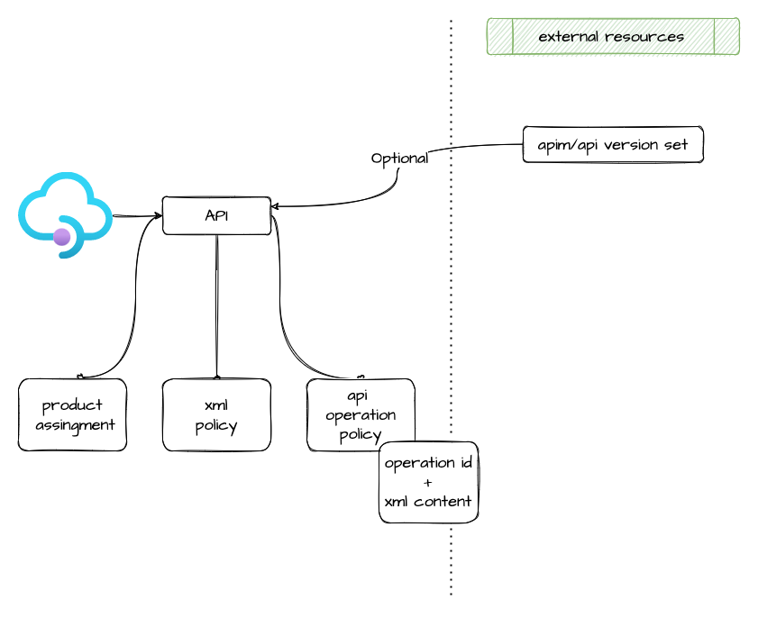

# api management api

This module allow the creation of api management product, and associate to a groups and create policy if requested

## Architecture



## How to use it

```ts

resource "azurerm_api_management_api_version_set" "apim_hub_spid_login_api" {
  name                = format("%s-spid-login-api", var.env_short)
  resource_group_name = azurerm_resource_group.rg_api.name
  api_management_name = module.apim.name
  display_name        = "SPID"
  versioning_scheme   = "Segment"
}

module "apim_hub_spid_login_api_v1" {
  source              = "git::https://github.com/pagopa/azurerm.git//api_management_api?ref=v1.0.58"
  name                = format("%s-spid-login-api-v1", local.project)
  api_management_name = module.apim.name
  resource_group_name = azurerm_resource_group.rg_api.name
  version_set_id      = azurerm_api_management_api_version_set.apim_hub_spid_login_api.id


  description  = "Login SPID Service Provider"
  display_name = "SPID V1"
  path         = "spid"
  api_version  = "v1"
  protocols    = ["https"]

  service_url = format("http://%s/spid/v1", var.reverse_proxy_ip)

  content_format = "swagger-json"
  content_value = templatefile("./api/hubspidlogin_api/v1/swagger.json.tpl", {
    host = "selc-d-apim.azure-api.net" //azurerm_api_management_custom_domain.api_custom_domain.proxy[0].host_name
  })

  xml_content = file("./api/base_policy.xml")

  subscription_required = false

  api_operation_policies = [
    {
      operation_id = "postACS"
      xml_content = templatefile("./api/hubspidlogin_api/v1/postacs_policy.xml.tpl", {
        origins = local.origins.spidAcsOrigins
      })
    },
    {
      operation_id = "getMetadata"
      xml_content  = file("./api/hubspidlogin_api/v1/metadata_policy.xml.tpl")
    }
  ]
}

```

<!-- markdownlint-disable -->
<!-- BEGINNING OF PRE-COMMIT-TERRAFORM DOCS HOOK -->
## Requirements

| Name | Version |
|------|---------|
| <a name="requirement_terraform"></a> [terraform](#requirement\_terraform) | >= 1.1.0 |
| <a name="requirement_azurerm"></a> [azurerm](#requirement\_azurerm) | >= 2.80.0, <= 2.99.0 |

## Providers

| Name | Version |
|------|---------|
| <a name="provider_azurerm"></a> [azurerm](#provider\_azurerm) | 2.99.0 |

## Modules

No modules.

## Resources

| Name | Type |
|------|------|
| [azurerm_api_management_api.this](https://registry.terraform.io/providers/hashicorp/azurerm/latest/docs/resources/api_management_api) | resource |
| [azurerm_api_management_api_operation_policy.api_operation_policy](https://registry.terraform.io/providers/hashicorp/azurerm/latest/docs/resources/api_management_api_operation_policy) | resource |
| [azurerm_api_management_api_policy.this](https://registry.terraform.io/providers/hashicorp/azurerm/latest/docs/resources/api_management_api_policy) | resource |
| [azurerm_api_management_product_api.this](https://registry.terraform.io/providers/hashicorp/azurerm/latest/docs/resources/api_management_product_api) | resource |

## Inputs

| Name | Description | Type | Default | Required |
|------|-------------|------|---------|:--------:|
| <a name="input_api_management_name"></a> [api\_management\_name](#input\_api\_management\_name) | n/a | `string` | n/a | yes |
| <a name="input_api_operation_policies"></a> [api\_operation\_policies](#input\_api\_operation\_policies) | List of api policy for given operation. | <pre>list(object({<br>    operation_id = string<br>    xml_content  = string<br>    }<br>  ))</pre> | `[]` | no |
| <a name="input_api_version"></a> [api\_version](#input\_api\_version) | The Version number of this API, if this API is versioned. | `string` | `null` | no |
| <a name="input_content_format"></a> [content\_format](#input\_content\_format) | The format of the content from which the API Definition should be imported. | `string` | `"swagger-json"` | no |
| <a name="input_content_value"></a> [content\_value](#input\_content\_value) | The Content from which the API Definition should be imported. | `string` | n/a | yes |
| <a name="input_description"></a> [description](#input\_description) | n/a | `string` | n/a | yes |
| <a name="input_display_name"></a> [display\_name](#input\_display\_name) | n/a | `string` | n/a | yes |
| <a name="input_name"></a> [name](#input\_name) | n/a | `string` | n/a | yes |
| <a name="input_oauth2_authorization"></a> [oauth2\_authorization](#input\_oauth2\_authorization) | n/a | <pre>object({<br>    authorization_server_name = string<br>    }<br>  )</pre> | <pre>{<br>  "authorization_server_name": null<br>}</pre> | no |
| <a name="input_path"></a> [path](#input\_path) | n/a | `string` | n/a | yes |
| <a name="input_product_ids"></a> [product\_ids](#input\_product\_ids) | n/a | `list(string)` | `[]` | no |
| <a name="input_protocols"></a> [protocols](#input\_protocols) | n/a | `list(string)` | n/a | yes |
| <a name="input_resource_group_name"></a> [resource\_group\_name](#input\_resource\_group\_name) | n/a | `string` | n/a | yes |
| <a name="input_revision"></a> [revision](#input\_revision) | n/a | `string` | `"1"` | no |
| <a name="input_revision_description"></a> [revision\_description](#input\_revision\_description) | n/a | `string` | `null` | no |
| <a name="input_service_url"></a> [service\_url](#input\_service\_url) | n/a | `string` | n/a | yes |
| <a name="input_subscription_required"></a> [subscription\_required](#input\_subscription\_required) | Should this API require a subscription key? | `bool` | `false` | no |
| <a name="input_version_set_id"></a> [version\_set\_id](#input\_version\_set\_id) | The ID of the Version Set which this API is associated with. | `string` | `null` | no |
| <a name="input_xml_content"></a> [xml\_content](#input\_xml\_content) | The XML Content for this Policy as a string | `string` | `null` | no |

## Outputs

| Name | Description |
|------|-------------|
| <a name="output_id"></a> [id](#output\_id) | n/a |
| <a name="output_name"></a> [name](#output\_name) | n/a |
<!-- END OF PRE-COMMIT-TERRAFORM DOCS HOOK -->
