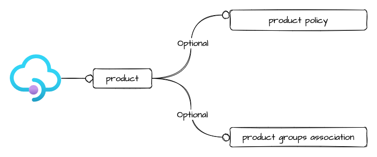

# api management product

This module allow the creation of api management product, and associate to a groups and create policy if requested

## Architecture



## How to use it

```ts
##############
## Products ##
##############

module "apim_product_devopslab" {
  source = "git::https://github.com/pagopa/azurerm.git//api_management_product?ref=v1.0.90"

  product_id   = "userregistry"
  display_name = "UserRegistry"
  description  = "Product for UserRegistry backend"

  api_management_name = module.apim.name
  resource_group_name = module.apim.resource_group_name

  published             = true
  subscription_required = true
  approval_required     = false

  policy_xml = file("./api_product/uservice_user_registry_management/_base_policy.xml")
}

```

<!-- markdownlint-disable -->
<!-- BEGINNING OF PRE-COMMIT-TERRAFORM DOCS HOOK -->
## Requirements

| Name | Version |
|------|---------|
| <a name="requirement_terraform"></a> [terraform](#requirement\_terraform) | >= 1.1.0 |
| <a name="requirement_azurerm"></a> [azurerm](#requirement\_azurerm) | >= 2.80.0, <= 2.99.0 |

## Providers

| Name | Version |
|------|---------|
| <a name="provider_azurerm"></a> [azurerm](#provider\_azurerm) | >= 2.80.0, <= 2.99.0 |

## Modules

No modules.

## Resources

| Name | Type |
|------|------|
| [azurerm_api_management_product.this](https://registry.terraform.io/providers/hashicorp/azurerm/latest/docs/resources/api_management_product) | resource |
| [azurerm_api_management_product_group.this](https://registry.terraform.io/providers/hashicorp/azurerm/latest/docs/resources/api_management_product_group) | resource |
| [azurerm_api_management_product_policy.this](https://registry.terraform.io/providers/hashicorp/azurerm/latest/docs/resources/api_management_product_policy) | resource |

## Inputs

| Name | Description | Type | Default | Required |
|------|-------------|------|---------|:--------:|
| <a name="input_api_management_name"></a> [api\_management\_name](#input\_api\_management\_name) | The name of the API Management Service. | `string` | n/a | yes |
| <a name="input_approval_required"></a> [approval\_required](#input\_approval\_required) | Do subscribers need to be approved prior to being able to use the Product? | `bool` | n/a | yes |
| <a name="input_description"></a> [description](#input\_description) | A description of this Product, which may include HTML formatting tags. | `string` | n/a | yes |
| <a name="input_display_name"></a> [display\_name](#input\_display\_name) | The Display Name for this API Management Product. | `string` | n/a | yes |
| <a name="input_groups"></a> [groups](#input\_groups) | (Optional) The groups where the product is included | `set(string)` | `[]` | no |
| <a name="input_policy_xml"></a> [policy\_xml](#input\_policy\_xml) | (Optional) The XML Content for this Product Policy. | `string` | `null` | no |
| <a name="input_product_id"></a> [product\_id](#input\_product\_id) | The Identifier for this Product, which must be unique within the API Management Service. | `string` | n/a | yes |
| <a name="input_published"></a> [published](#input\_published) | Is this Product Published? | `bool` | n/a | yes |
| <a name="input_resource_group_name"></a> [resource\_group\_name](#input\_resource\_group\_name) | The name of the Resource Group in which the API Management Service should be exist. | `string` | n/a | yes |
| <a name="input_subscription_required"></a> [subscription\_required](#input\_subscription\_required) | Is a Subscription required to access API's included in this Product? | `bool` | n/a | yes |
| <a name="input_subscriptions_limit"></a> [subscriptions\_limit](#input\_subscriptions\_limit) | The number of subscriptions a user can have to this Product at the same time. | `number` | `null` | no |

## Outputs

| Name | Description |
|------|-------------|
| <a name="output_id"></a> [id](#output\_id) | n/a |
| <a name="output_product_id"></a> [product\_id](#output\_product\_id) | n/a |
<!-- END OF PRE-COMMIT-TERRAFORM DOCS HOOK -->
