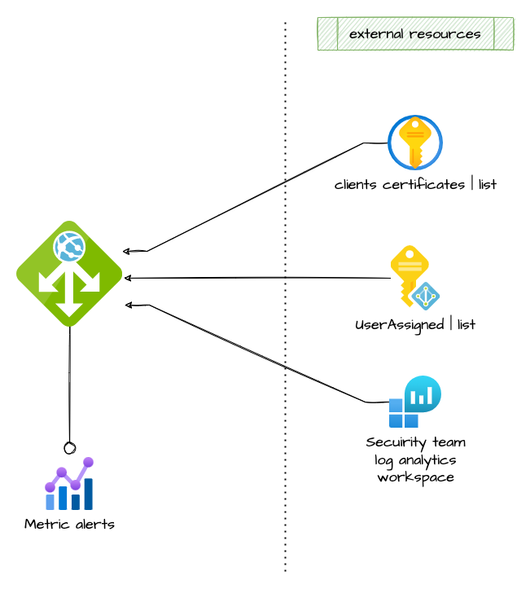

# app gateway

<!-- vscode-markdown-toc -->
* 1. [Architecture](#Architecture)
* 2. [How to use it](#Howtouseit)
	* 2.1. [External resources](#Externalresources)
	* 2.2. [App gateway definition](#Appgatewaydefinition)
* 3. [Requirements](#Requirements)
* 4. [Providers](#Providers)
* 5. [Modules](#Modules)
* 6. [Resources](#Resources)
* 7. [Inputs](#Inputs)
* 8. [Outputs](#Outputs)

<!-- vscode-markdown-toc-config
	numbering=true
	autoSave=true
	/vscode-markdown-toc-config -->
<!-- /vscode-markdown-toc -->


Module that allows the creation of an App Gateway.

##  1. <a name='Architecture'></a>Architecture



##  2. <a name='Howtouseit'></a>How to use it

###  2.1. <a name='Externalresources'></a>External resources

```ts
data "azurerm_public_ip" "appgateway_public_ip" {
  resource_group_name = data.azurerm_resource_group.rg_vnet.name
  name                = local.pip_appgw_name
}

data "azurerm_key_vault_certificate" "app_gw_api" {
  name         = var.app_gateway_api_certificate_name
  key_vault_id = data.azurerm_key_vault.kv.id
}

## user assined identity: (application gateway) ##
resource "azurerm_user_assigned_identity" "appgateway" {
  resource_group_name = data.azurerm_resource_group.kv_rg.name
  location            = data.azurerm_resource_group.kv_rg.location
  name                = format("%s-appgateway-identity", local.project)

  tags = var.tags
}

resource "azurerm_key_vault_access_policy" "app_gateway_policy" {
  key_vault_id            = data.azurerm_key_vault.kv.id
  tenant_id               = data.azurerm_client_config.current.tenant_id
  object_id               = azurerm_user_assigned_identity.appgateway.principal_id
  key_permissions         = []
  secret_permissions      = ["Get", "List"]
  certificate_permissions = ["Get", "List"]
  storage_permissions     = []
}

# Subnet to host the application gateway
module "appgateway_snet" {
  source               = "git::https://github.com/pagopa/azurerm.git//subnet?ref=v2.1.21"

  name                 = "${local.project}-appgateway-snet"
  address_prefixes     = var.cidr_subnet_appgateway
  virtual_network_name = data.azurerm_virtual_network.vnet.name
  
  resource_group_name  = data.azurerm_resource_group.rg_vnet.name
}
```

###  2.2. <a name='Appgatewaydefinition'></a>App gateway definition

```ts
## Application gateway ##
module "app_gw" {
  source = "git::https://github.com/pagopa/azurerm.git//app_gateway?ref=v2.1.21"

  name                = "${local.project}-app-gw"
  resource_group_name = data.azurerm_resource_group.rg_vnet.name
  location            = data.azurerm_resource_group.rg_vnet.location

  # SKU
  sku_name = var.app_gateway_sku_name
  sku_tier = var.app_gateway_sku_tier

  # WAF
  waf_enabled = var.app_gateway_waf_enabled

  # Networking
  subnet_id    = module.appgateway_snet.id
  public_ip_id = data.azurerm_public_ip.appgateway_public_ip.id

  # Configure backends
  backends = {

    apim = {
      protocol                    = "Https"
      host                        = "api.internal.devopslab.pagopa.it"
      port                        = 443
      ip_addresses                = null # with null value use fqdns
      fqdns                       = ["api.internal.devopslab.pagopa.it"]
      probe_name                  = "probe-apim"
      probe                       = "/status-0123456789abcdef"
      request_timeout             = 2
      pick_host_name_from_backend = false
    }
  }

  trusted_client_certificates = []

  # Configure listeners
  listeners = {

    api = {
      protocol           = "Https"
      host               = "api.${var.prod_dns_zone_prefix}.${var.external_domain}"
      port               = 443
      ssl_profile_name   = null
      firewall_policy_id = null

      certificate = {
        name = var.app_gateway_api_certificate_name
        id = replace(
          data.azurerm_key_vault_certificate.app_gw_api.secret_id,
          "/${data.azurerm_key_vault_certificate.app_gw_api.version}",
          ""
        )
      }
    }
  }

  # maps listener to backend
  routes = {
    api = {
      listener              = "api"
      backend               = "apim"
      rewrite_rule_set_name = "rewrite-rule-set-api"
    }
  }

  rewrite_rule_sets = [
    {
      name = "rewrite-rule-set-api"
      rewrite_rules = [{
        name          = "http-headers-api"
        rule_sequence = 100
        condition     = null
        request_header_configurations = [
          {
            header_name  = "X-Forwarded-For"
            header_value = "{var_client_ip}"
          },
          {
            header_name  = "X-Client-Ip"
            header_value = "{var_client_ip}"
          },
        ]
        response_header_configurations = []
        url = null
      }]
    },
  ]

  # TLS
  identity_ids = [azurerm_user_assigned_identity.appgateway.id]

  # Scaling
  app_gateway_min_capacity = var.app_gateway_min_capacity
  app_gateway_max_capacity = var.app_gateway_max_capacity

  # Logs
  # sec_log_analytics_workspace_id = var.env_short == "p" ? data.azurerm_key_vault_secret.sec_workspace_id[0].value : null
  # sec_storage_id                 = var.env_short == "p" ? data.azurerm_key_vault_secret.sec_storage_id[0].value : null

  alerts_enabled = var.app_gateway_alerts_enabled

  action = [
    {
      action_group_id    = data.azurerm_monitor_action_group.slack.id
      webhook_properties = null
    },
    {
      action_group_id    = data.azurerm_monitor_action_group.email.id
      webhook_properties = null
    }
  ]

  # metrics docs
  # https://docs.microsoft.com/en-us/azure/azure-monitor/essentials/metrics-supported#microsoftnetworkapplicationgateways
  monitor_metric_alert_criteria = {

    compute_units_usage = {
      description   = "Abnormal compute units usage, probably an high traffic peak"
      frequency     = "PT5M"
      window_size   = "PT5M"
      severity      = 2
      auto_mitigate = true

      criteria = []
      dynamic_criteria = [
        {
          aggregation              = "Average"
          metric_name              = "ComputeUnits"
          operator                 = "GreaterOrLessThan"
          alert_sensitivity        = "High"
          evaluation_total_count   = 2
          evaluation_failure_count = 2
          dimension                = []
        }
      ]
    }

    backend_pools_status = {
      description   = "One or more backend pools are down, check Backend Health on Azure portal"
      frequency     = "PT5M"
      window_size   = "PT5M"
      severity      = 0
      auto_mitigate = true

      criteria = [
        {
          aggregation = "Average"
          metric_name = "UnhealthyHostCount"
          operator    = "GreaterThan"
          threshold   = 0
          dimension   = []
        }
      ]
      dynamic_criteria = []
    }

    response_time = {
      description   = "Backends response time is too high"
      frequency     = "PT5M"
      window_size   = "PT5M"
      severity      = 2
      auto_mitigate = true

      criteria = []
      dynamic_criteria = [
        {
          aggregation              = "Average"
          metric_name              = "BackendLastByteResponseTime"
          operator                 = "GreaterThan"
          alert_sensitivity        = "High"
          evaluation_total_count   = 2
          evaluation_failure_count = 2
          dimension                = []
        }
      ]
    }

    total_requests = {
      description   = "Traffic is raising"
      frequency     = "PT5M"
      window_size   = "PT15M"
      severity      = 3
      auto_mitigate = true

      criteria = []
      dynamic_criteria = [
        {
          aggregation              = "Total"
          metric_name              = "TotalRequests"
          operator                 = "GreaterThan"
          alert_sensitivity        = "Medium"
          evaluation_total_count   = 1
          evaluation_failure_count = 1
          dimension                = []
        }
      ]
    }

    failed_requests = {
      description   = "Abnormal failed requests"
      frequency     = "PT5M"
      window_size   = "PT5M"
      severity      = 1
      auto_mitigate = true

      criteria = []
      dynamic_criteria = [
        {
          aggregation              = "Total"
          metric_name              = "FailedRequests"
          operator                 = "GreaterThan"
          alert_sensitivity        = "High"
          evaluation_total_count   = 2
          evaluation_failure_count = 2
          dimension                = []
        }
      ]
    }
  }

  tags = var.tags
}

```

<!-- markdownlint-disable -->
<!-- BEGINNING OF PRE-COMMIT-TERRAFORM DOCS HOOK -->
##  3. <a name='Requirements'></a>Requirements

No requirements.

##  4. <a name='Providers'></a>Providers

| Name | Version |
|------|---------|
| <a name="provider_azurerm"></a> [azurerm](#provider\_azurerm) | n/a |

##  5. <a name='Modules'></a>Modules

No modules.

##  6. <a name='Resources'></a>Resources

| Name | Type |
|------|------|
| [azurerm_application_gateway.this](https://registry.terraform.io/providers/hashicorp/azurerm/latest/docs/resources/application_gateway) | resource |
| [azurerm_monitor_diagnostic_setting.app_gw](https://registry.terraform.io/providers/hashicorp/azurerm/latest/docs/resources/monitor_diagnostic_setting) | resource |
| [azurerm_monitor_metric_alert.this](https://registry.terraform.io/providers/hashicorp/azurerm/latest/docs/resources/monitor_metric_alert) | resource |
| [azurerm_key_vault_secret.client_cert](https://registry.terraform.io/providers/hashicorp/azurerm/latest/docs/data-sources/key_vault_secret) | data source |

##  7. <a name='Inputs'></a>Inputs

| Name | Description | Type | Default | Required |
|------|-------------|------|---------|:--------:|
| <a name="input_app_gateway_max_capacity"></a> [app\_gateway\_max\_capacity](#input\_app\_gateway\_max\_capacity) | n/a | `string` | n/a | yes |
| <a name="input_app_gateway_min_capacity"></a> [app\_gateway\_min\_capacity](#input\_app\_gateway\_min\_capacity) | n/a | `string` | n/a | yes |
| <a name="input_backends"></a> [backends](#input\_backends) | n/a | <pre>map(object({<br>    protocol                    = string<br>    host                        = string<br>    port                        = number<br>    ip_addresses                = list(string)<br>    fqdns                       = list(string)<br>    probe                       = string<br>    probe_name                  = string<br>    request_timeout             = number<br>    pick_host_name_from_backend = bool<br>  }))</pre> | n/a | yes |
| <a name="input_identity_ids"></a> [identity\_ids](#input\_identity\_ids) | n/a | `list(string)` | n/a | yes |
| <a name="input_listeners"></a> [listeners](#input\_listeners) | n/a | <pre>map(object({<br>    protocol           = string<br>    host               = string<br>    port               = number<br>    ssl_profile_name   = string<br>    firewall_policy_id = string<br>    certificate = object({<br>      name = string<br>      id   = string<br>    })<br>  }))</pre> | n/a | yes |
| <a name="input_name"></a> [name](#input\_name) | n/a | `string` | n/a | yes |
| <a name="input_public_ip_id"></a> [public\_ip\_id](#input\_public\_ip\_id) | Public IP | `string` | n/a | yes |
| <a name="input_resource_group_name"></a> [resource\_group\_name](#input\_resource\_group\_name) | n/a | `string` | n/a | yes |
| <a name="input_routes"></a> [routes](#input\_routes) | n/a | <pre>map(object({<br>    listener              = string<br>    backend               = string<br>    rewrite_rule_set_name = string<br>  }))</pre> | n/a | yes |
| <a name="input_sku_name"></a> [sku\_name](#input\_sku\_name) | SKU Name of the App GW | `string` | n/a | yes |
| <a name="input_sku_tier"></a> [sku\_tier](#input\_sku\_tier) | SKU tier of the App GW | `string` | n/a | yes |
| <a name="input_subnet_id"></a> [subnet\_id](#input\_subnet\_id) | Subnet dedicated to the app gateway | `string` | n/a | yes |
| <a name="input_tags"></a> [tags](#input\_tags) | n/a | `map(any)` | n/a | yes |
| <a name="input_trusted_client_certificates"></a> [trusted\_client\_certificates](#input\_trusted\_client\_certificates) | Note: the attribute secret\_name refers to the secret contaning the client certificate. Secrects'name in the key vault can't have low hyphens but just hyphens in it. | <pre>list(object({<br>    secret_name  = string<br>    key_vault_id = string<br>  }))</pre> | n/a | yes |
| <a name="input_action"></a> [action](#input\_action) | The ID of the Action Group and optional map of custom string properties to include with the post webhook operation. | <pre>set(object(<br>    {<br>      action_group_id    = string<br>      webhook_properties = map(string)<br>    }<br>  ))</pre> | `[]` | no |
| <a name="input_alerts_enabled"></a> [alerts\_enabled](#input\_alerts\_enabled) | Should Metric Alerts be enabled? | `bool` | `true` | no |
| <a name="input_location"></a> [location](#input\_location) | n/a | `string` | `"westeurope"` | no |
| <a name="input_monitor_metric_alert_criteria"></a> [monitor\_metric\_alert\_criteria](#input\_monitor\_metric\_alert\_criteria) | Map of name = criteria objects, see these docs for options<br>https://docs.microsoft.com/en-us/azure/azure-monitor/essentials/metrics-supported#microsoftnetworkapplicationgateways | <pre>map(object({<br><br>    description = string<br>    # Possible values are PT1M, PT5M, PT15M, PT30M and PT1H<br>    frequency = string<br>    # Possible values are PT1M, PT5M, PT15M, PT30M, PT1H, PT6H, PT12H and P1D.<br>    window_size = string<br>    # Possible values are 0, 1, 2, 3.<br>    severity = number<br>    # Possible values are true, false<br>    auto_mitigate = bool<br><br>    # static<br>    criteria = list(object(<br>      {<br>        # criteria.*.aggregation to be one of [Average Count Minimum Maximum Total]<br>        aggregation = string<br>        metric_name = string<br>        # criteria.0.operator to be one of [Equals NotEquals GreaterThan GreaterThanOrEqual LessThan LessThanOrEqual]<br>        operator  = string<br>        threshold = number<br><br>        dimension = list(object(<br>          {<br>            name     = string<br>            operator = string<br>            values   = list(string)<br>          }<br>        ))<br>      }<br>    ))<br><br>    # dynamic<br>    dynamic_criteria = list(object(<br>      {<br>        # criteria.*.aggregation to be one of [Average Count Minimum Maximum Total]<br>        aggregation = string<br>        metric_name = string<br>        # criteria.0.operator to be one of [Equals NotEquals GreaterThan GreaterThanOrEqual LessThan LessThanOrEqual]<br>        operator = string<br>        # Possible values are Low, Medium, High<br>        alert_sensitivity = string<br><br>        evaluation_total_count   = number<br>        evaluation_failure_count = number<br><br>        dimension = list(object(<br>          {<br>            name     = string<br>            operator = string<br>            values   = list(string)<br>          }<br>        ))<br>      }<br>    ))<br>  }))</pre> | `{}` | no |
| <a name="input_rewrite_rule_sets"></a> [rewrite\_rule\_sets](#input\_rewrite\_rule\_sets) | n/a | <pre>list(object({<br>    name = string<br>    rewrite_rules = list(object({<br>      name          = string<br>      rule_sequence = number<br>      condition = object({<br>        variable    = string<br>        pattern     = string<br>        ignore_case = bool<br>        negate      = bool<br>      })<br><br>      request_header_configurations = list(object({<br>        header_name  = string<br>        header_value = string<br>      }))<br><br>      response_header_configurations = list(object({<br>        header_name  = string<br>        header_value = string<br>      }))<br><br>    }))<br>  }))</pre> | `[]` | no |
| <a name="input_sec_log_analytics_workspace_id"></a> [sec\_log\_analytics\_workspace\_id](#input\_sec\_log\_analytics\_workspace\_id) | Log analytics workspace security (it should be in a different subscription). | `string` | `null` | no |
| <a name="input_sec_storage_id"></a> [sec\_storage\_id](#input\_sec\_storage\_id) | Storage Account security (it should be in a different subscription). | `string` | `null` | no |
| <a name="input_ssl_profiles"></a> [ssl\_profiles](#input\_ssl\_profiles) | n/a | <pre>list(object({<br>    name                             = string<br>    trusted_client_certificate_names = list(string)<br>    verify_client_cert_issuer_dn     = bool<br><br>    ssl_policy = object({<br>      disabled_protocols   = list(string)<br>      policy_type          = string<br>      policy_name          = string<br>      cipher_suites        = list(string)<br>      min_protocol_version = string<br>    })<br>  }))</pre> | `[]` | no |
| <a name="input_waf_disabled_rule_group"></a> [waf\_disabled\_rule\_group](#input\_waf\_disabled\_rule\_group) | n/a | <pre>list(object({<br>    rule_group_name = string<br>    rules           = list(string)<br>  }))</pre> | `[]` | no |
| <a name="input_waf_enabled"></a> [waf\_enabled](#input\_waf\_enabled) | Enable WAF | `bool` | `true` | no |

##  8. <a name='Outputs'></a>Outputs

| Name | Description |
|------|-------------|
| <a name="output_id"></a> [id](#output\_id) | n/a |
| <a name="output_name"></a> [name](#output\_name) | n/a |
<!-- END OF PRE-COMMIT-TERRAFORM DOCS HOOK -->
