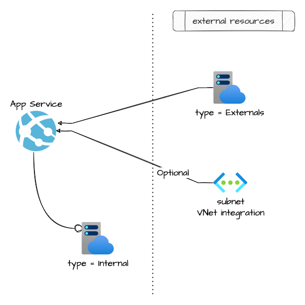

# app service

This module allow the creation of an app service

## Architecture



## How to use it

### Docker Version

```json
resource "azurerm_resource_group" "api_config_rg" {
  count    = var.api_config_enabled ? 1 : 0
  name     = format("%s-api-config-rg", local.project)
  location = var.location

  tags = var.tags
}

locals {
  apiconfig_cors_configuration = {
    origins = ["*"]
    methods = ["*"]
  }
}

# Subnet to host the api config
module "api_config_snet" {
  count                                          = var.api_config_enabled && var.cidr_subnet_api_config != null ? 1 : 0
  source                                         = "git::https://github.com/pagopa/azurerm.git//subnet?ref=v1.0.51"
  name                                           = format("%s-api-config-snet", local.project)
  address_prefixes                               = var.cidr_subnet_api_config
  resource_group_name                            = azurerm_resource_group.rg_vnet.name
  virtual_network_name                           = module.vnet_integration.name
  enforce_private_link_endpoint_network_policies = true

  delegation = {
    name = "default"
    service_delegation = {
      name    = "Microsoft.Web/serverFarms"
      actions = ["Microsoft.Network/virtualNetworks/subnets/action"]
    }
  }
}

module "api_config_app_service" {
  count  = var.api_config_enabled ? 1 : 0
  source = "git::https://github.com/pagopa/azurerm.git//app_service?ref=v1.0.93"

  resource_group_name = azurerm_resource_group.api_config_rg[0].name
  location            = var.location

  # App service plan vars
  plan_name     = format("%s-plan-api-config", local.project)
  plan_kind     = "Linux"
  plan_sku_tier = var.api_config_tier
  plan_sku_size = var.api_config_size
  plan_reserved = true # Mandatory for Linux plan

  # App service plan
  name                = format("%s-app-api-config", local.project)
  client_cert_enabled = false
  always_on           = var.api_config_always_on
  # linux_fx_version    = "JAVA|11-java11"
  linux_fx_version  = format("DOCKER|%s/api-apiconfig-backend:%s", module.acr[0].login_server, "latest")
  health_check_path = "/apiconfig/api/v1/info"


  app_settings = {
    # Monitoring
    APPINSIGHTS_INSTRUMENTATIONKEY                  = azurerm_application_insights.application_insights.instrumentation_key
    APPLICATIONINSIGHTS_CONNECTION_STRING           = format("InstrumentationKey=%s", azurerm_application_insights.application_insights.instrumentation_key)
    APPINSIGHTS_PROFILERFEATURE_VERSION             = "1.0.0"
    APPINSIGHTS_SNAPSHOTFEATURE_VERSION             = "1.0.0"
    APPLICATIONINSIGHTS_CONFIGURATION_CONTENT       = ""
    ApplicationInsightsAgent_EXTENSION_VERSION      = "~3"
    DiagnosticServices_EXTENSION_VERSION            = "~3"
    InstrumentationEngine_EXTENSION_VERSION         = "disabled"
    SnapshotDebugger_EXTENSION_VERSION              = "disabled"
    XDT_MicrosoftApplicationInsights_BaseExtensions = "disabled"
    XDT_MicrosoftApplicationInsights_Mode           = "recommended"
    XDT_MicrosoftApplicationInsights_PreemptSdk     = "disabled"
    WEBSITE_HEALTHCHECK_MAXPINGFAILURES             = 10
    TIMEOUT_DELAY                                   = 300
    # Integration with private DNS (see more: https://docs.microsoft.com/en-us/answers/questions/85359/azure-app-service-unable-to-resolve-hostname-of-vi.html)
    WEBSITE_DNS_SERVER = "168.63.129.16"
    # Spring Environment
    SPRING_DATASOURCE_USERNAME = data.azurerm_key_vault_secret.db_nodo_usr.value
    SPRING_DATASOURCE_PASSWORD = data.azurerm_key_vault_secret.db_nodo_pwd.value
    SPRING_DATASOURCE_URL      = var.db_service_name == null ? null : format("jdbc:oracle:thin:@%s.%s:%s/%s", azurerm_private_dns_a_record.private_dns_a_record_db_nodo.name, azurerm_private_dns_zone.db_nodo_dns_zone.name, var.db_port, var.db_service_name)
    CORS_CONFIGURATION         = jsonencode(local.apiconfig_cors_configuration)
    XSD_ICA                    = var.xsd_ica

    WEBSITES_ENABLE_APP_SERVICE_STORAGE = false
    WEBSITES_PORT                       = 8080
    # WEBSITE_SWAP_WARMUP_PING_PATH       = "/actuator/health"
    # WEBSITE_SWAP_WARMUP_PING_STATUSES   = "200"
    DOCKER_REGISTRY_SERVER_URL      = "https://${module.acr[0].login_server}"
    DOCKER_REGISTRY_SERVER_USERNAME = module.acr[0].admin_username
    DOCKER_REGISTRY_SERVER_PASSWORD = module.acr[0].admin_password

  }

  allowed_subnets = [module.apim_snet.id]
  allowed_ips     = []

  subnet_name = module.api_config_snet[0].name
  subnet_id   = module.api_config_snet[0].id

  tags = var.tags
}
```

<!-- markdownlint-disable -->
<!-- BEGINNING OF PRE-COMMIT-TERRAFORM DOCS HOOK -->
## Requirements

No requirements.

## Providers

| Name | Version |
|------|---------|
| <a name="provider_azurerm"></a> [azurerm](#provider\_azurerm) | n/a |

## Modules

No modules.

## Resources

| Name | Type |
|------|------|
| [azurerm_app_service.this](https://registry.terraform.io/providers/hashicorp/azurerm/latest/docs/resources/app_service) | resource |
| [azurerm_app_service_plan.this](https://registry.terraform.io/providers/hashicorp/azurerm/latest/docs/resources/app_service_plan) | resource |
| [azurerm_app_service_virtual_network_swift_connection.app_service_virtual_network_swift_connection](https://registry.terraform.io/providers/hashicorp/azurerm/latest/docs/resources/app_service_virtual_network_swift_connection) | resource |

## Inputs

| Name | Description | Type | Default | Required |
|------|-------------|------|---------|:--------:|
| <a name="input_name"></a> [name](#input\_name) | (Required) Specifies the name of the App Service. Changing this forces a new resource to be created. | `string` | n/a | yes |
| <a name="input_resource_group_name"></a> [resource\_group\_name](#input\_resource\_group\_name) | (Required) The name of the resource group in which to create the App Service and App Service Plan. | `string` | n/a | yes |
| <a name="input_tags"></a> [tags](#input\_tags) | n/a | `map(any)` | n/a | yes |
| <a name="input_allowed_ips"></a> [allowed\_ips](#input\_allowed\_ips) | (Optional) List of ips allowed to call the appserver endpoint. | `list(string)` | `[]` | no |
| <a name="input_allowed_subnets"></a> [allowed\_subnets](#input\_allowed\_subnets) | (Optional) List of subnet allowed to call the appserver endpoint. | `list(string)` | `[]` | no |
| <a name="input_always_on"></a> [always\_on](#input\_always\_on) | (Optional) Should the app be loaded at all times? Defaults to false. | `bool` | `false` | no |
| <a name="input_app_command_line"></a> [app\_command\_line](#input\_app\_command\_line) | (Optional) App command line to launch, e.g. /sbin/myserver -b 0.0.0.0. | `string` | `null` | no |
| <a name="input_app_settings"></a> [app\_settings](#input\_app\_settings) | n/a | `map(string)` | `{}` | no |
| <a name="input_client_cert_enabled"></a> [client\_cert\_enabled](#input\_client\_cert\_enabled) | (Optional) Does the App Service require client certificates for incoming requests? Defaults to false. | `bool` | `false` | no |
| <a name="input_ftps_state"></a> [ftps\_state](#input\_ftps\_state) | (Optional) Enable FTPS connection ( Default: Disabled ) | `string` | `"Disabled"` | no |
| <a name="input_health_check_path"></a> [health\_check\_path](#input\_health\_check\_path) | (Optional) The health check path to be pinged by App Service. | `string` | `null` | no |
| <a name="input_linux_fx_version"></a> [linux\_fx\_version](#input\_linux\_fx\_version) | (Optional) Linux App Framework and version for the App Service. | `string` | `null` | no |
| <a name="input_location"></a> [location](#input\_location) | (Required) Specifies the supported Azure location where the resource exists. Changing this forces a new resource to be created. | `string` | `"westeurope"` | no |
| <a name="input_plan_id"></a> [plan\_id](#input\_plan\_id) | (Optional) Specifies the external app service plan id. | `string` | `null` | no |
| <a name="input_plan_kind"></a> [plan\_kind](#input\_plan\_kind) | (Optional) The kind of the App Service Plan to create. Possible values are Windows (also available as App), Linux, elastic (for Premium Consumption) and FunctionApp (for a Consumption Plan). Changing this forces a new resource to be created. | `string` | `null` | no |
| <a name="input_plan_maximum_elastic_worker_count"></a> [plan\_maximum\_elastic\_worker\_count](#input\_plan\_maximum\_elastic\_worker\_count) | (Optional) The maximum number of total workers allowed for this ElasticScaleEnabled App Service Plan. | `number` | `null` | no |
| <a name="input_plan_name"></a> [plan\_name](#input\_plan\_name) | (Optional) Specifies the name of the App Service Plan component. Changing this forces a new resource to be created. | `string` | `null` | no |
| <a name="input_plan_per_site_scaling"></a> [plan\_per\_site\_scaling](#input\_plan\_per\_site\_scaling) | (Optional) Can Apps assigned to this App Service Plan be scaled independently? If set to false apps assigned to this plan will scale to all instances of the plan. Defaults to false. | `bool` | `false` | no |
| <a name="input_plan_reserved"></a> [plan\_reserved](#input\_plan\_reserved) | (Optional) Is this App Service Plan Reserved. When creating a Linux App Service Plan, the reserved field must be set to true, and when creating a Windows/app App Service Plan the reserved field must be set to false. | `bool` | `null` | no |
| <a name="input_plan_sku_size"></a> [plan\_sku\_size](#input\_plan\_sku\_size) | (Optional) Specifies the plan's instance size. | `string` | `null` | no |
| <a name="input_plan_sku_tier"></a> [plan\_sku\_tier](#input\_plan\_sku\_tier) | (Optional) Specifies the plan's pricing tier. | `string` | `null` | no |
| <a name="input_plan_type"></a> [plan\_type](#input\_plan\_type) | (Required) Specifies if app service plan is external or internal | `string` | `"internal"` | no |
| <a name="input_subnet_id"></a> [subnet\_id](#input\_subnet\_id) | (Optional) Subnet id wether you want to integrate the app service to a subnet. | `string` | `null` | no |
| <a name="input_vnet_integration"></a> [vnet\_integration](#input\_vnet\_integration) | (optional) enable vnet integration. Wheter it's true the subnet\_id should not be null. | `bool` | `false` | no |
| <a name="input_vnet_route_all_enabled"></a> [vnet\_route\_all\_enabled](#input\_vnet\_route\_all\_enabled) | Should all outbound traffic to have Virtual Network Security Groups and User Defined Routes applied? | `bool` | `true` | no |

## Outputs

| Name | Description |
|------|-------------|
| <a name="output_custom_domain_verification_id"></a> [custom\_domain\_verification\_id](#output\_custom\_domain\_verification\_id) | n/a |
| <a name="output_default_site_hostname"></a> [default\_site\_hostname](#output\_default\_site\_hostname) | n/a |
| <a name="output_id"></a> [id](#output\_id) | n/a |
| <a name="output_name"></a> [name](#output\_name) | n/a |
| <a name="output_plan_id"></a> [plan\_id](#output\_plan\_id) | n/a |
| <a name="output_plan_name"></a> [plan\_name](#output\_plan\_name) | n/a |
| <a name="output_principal_id"></a> [principal\_id](#output\_principal\_id) | n/a |

<!-- END OF PRE-COMMIT-TERRAFORM DOCS HOOK -->
