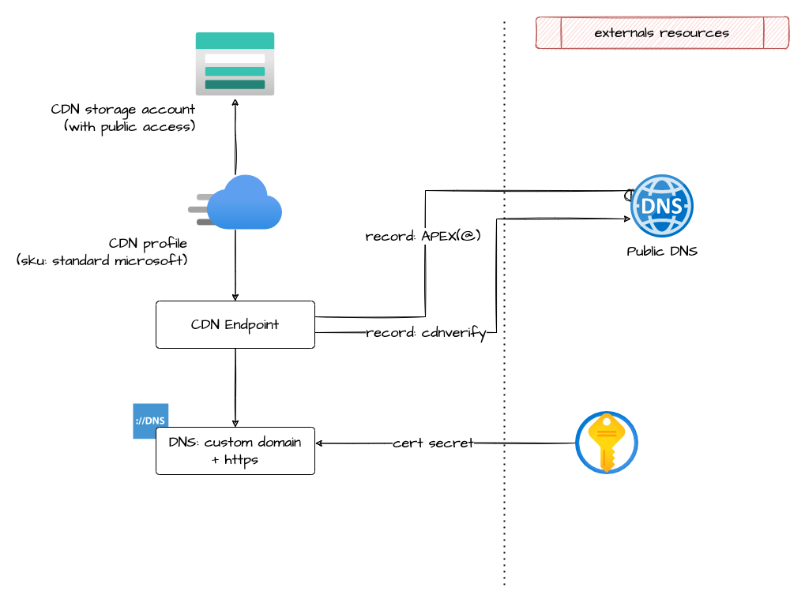

# EventHub

This module allow the creation of a CDN endpoint and CDN profile

## Architecture



## How to use it

```ts

/**
 * Checkout resource group
 **/
resource "azurerm_resource_group" "checkout_fe_rg" {
  name     = format("%s-checkout-fe-rg", local.project)
  location = var.location

  tags = var.tags
}

locals {
  spa = [
    for i, spa in var.spa :
    {
      name  = replace(format("SPA-%s", spa), "-", "")
      order = i + 3 // +3 required because the order start from 1: 1 is reserved for default application redirect; 2 is reserved for the https rewrite;
      conditions = [
        {
          condition_type   = "url_path_condition"
          operator         = "BeginsWith"
          match_values     = [format("/%s/", spa)]
          negate_condition = false
          transforms       = null
        },
        {
          condition_type   = "url_file_extension_condition"
          operator         = "LessThanOrEqual"
          match_values     = ["0"]
          negate_condition = false
          transforms       = null
        },
      ]
      url_rewrite_action = {
        source_pattern          = format("/%s/", spa)
        destination             = format("/%s/index.html", spa)
        preserve_unmatched_path = false
      }
    }
  ]
  cors = {
    paths = ["/assets/"]
  }
}

/**
 * CDN
 */
// public storage used to serve FE
#tfsec:ignore:azure-storage-default-action-deny
module "checkout_cdn" {
  source = "git::https://github.com/pagopa/azurerm.git//cdn?ref=v2.12.1"

  name                  = "checkout"
  prefix                = local.project
  resource_group_name   = azurerm_resource_group.checkout_fe_rg.name
  location              = var.location
  hostname              = format("%s.%s", var.dns_zone_prefix, var.external_domain)
  https_rewrite_enabled = true
  lock_enabled          = var.lock_enable

  index_document     = "index.html"
  error_404_document = "error.html"

  dns_zone_name                = azurerm_dns_zone.selfcare_public[0].name
  dns_zone_resource_group_name = azurerm_dns_zone.selfcare_public[0].resource_group_name

  keyvault_resource_group_name = module.key_vault.resource_group_name
  keyvault_subscription_id     = data.azurerm_subscription.current.subscription_id
  keyvault_vault_name          = module.key_vault.name

  querystring_caching_behaviour = "BypassCaching"

  global_delivery_rule = {
    cache_expiration_action       = []
    cache_key_query_string_action = []
    modify_request_header_action  = []

    # HSTS
    modify_response_header_action = [{
      action = "Overwrite"
      name   = "Strict-Transport-Security"
      value  = "max-age=31536000"
      },
      # Content-Security-Policy (in Report mode)
      {
        action = "Overwrite"
        name   = "Content-Security-Policy-Report-Only"
        value = format("default-src 'self'; object-src 'none'; connect-src 'self' https://api.%s.%s/ https://api-eu.mixpanel.com/track/; "
        , var.dns_zone_prefix, var.external_domain)
      },
      {
        action = "Append"
        name   = "Content-Security-Policy-Report-Only"
        value  = "script-src 'self'; style-src 'self' 'unsafe-inline' https://selfcare.pagopa.it/assets/font/selfhostedfonts.css; worker-src 'none'; font-src 'self' https://selfcare.pagopa.it/assets/font/; "
      },
      {
        action = "Append"
        name   = "Content-Security-Policy-Report-Only"
        value  = format("img-src 'self' https://assets.cdn.io.italia.it https://%s data:; ", module.checkout_cdn.storage_primary_web_host)
      },
      {
        action = "Append"
        name   = "X-Content-Type-Options"
        value  = "nosniff"
      }
    ]
  }

  delivery_rule_rewrite = concat([{
    name  = "defaultApplication"
    order = 2
    conditions = [
      {
        condition_type   = "url_path_condition"
        operator         = "Equal"
        match_values     = ["/"]
        negate_condition = false
        transforms       = null
      }
    ]
    url_rewrite_action = {
      source_pattern          = "/"
      destination             = "/dashboard/index.html"
      preserve_unmatched_path = false
    }
    }],
    local.spa
  )

  delivery_rule = [
    {
      name  = "robotsNoIndex"
      order = 3 + length(local.spa)

      // conditions
      url_path_conditions = [{
        operator         = "Equal"
        match_values     = length(var.robots_indexed_paths) > 0 ? var.robots_indexed_paths : ["dummy"]
        negate_condition = true
        transforms       = null
      }]
      cookies_conditions            = []
      device_conditions             = []
      http_version_conditions       = []
      post_arg_conditions           = []
      query_string_conditions       = []
      remote_address_conditions     = []
      request_body_conditions       = []
      request_header_conditions     = []
      request_method_conditions     = []
      request_scheme_conditions     = []
      request_uri_conditions        = []
      url_file_extension_conditions = []
      url_file_name_conditions      = []

      // actions
      modify_response_header_actions = [{
        action = "Overwrite"
        name   = "X-Robots-Tag"
        value  = "noindex, nofollow"
      }]
      cache_expiration_actions       = []
      cache_key_query_string_actions = []
      modify_request_header_actions  = []
      url_redirect_actions           = []
      url_rewrite_actions            = []
    },
    {
      name  = "microcomponentsNoCache"
      order = 4 + length(local.spa)

      // conditions
      url_path_conditions           = []
      cookies_conditions            = []
      device_conditions             = []
      http_version_conditions       = []
      post_arg_conditions           = []
      query_string_conditions       = []
      remote_address_conditions     = []
      request_body_conditions       = []
      request_header_conditions     = []
      request_method_conditions     = []
      request_scheme_conditions     = []
      request_uri_conditions        = []
      url_file_extension_conditions = []

      url_file_name_conditions = [{
        operator         = "Equal"
        match_values     = ["remoteEntry.js"]
        negate_condition = false
        transforms       = null
      }]

      // actions
      modify_response_header_actions = [{
        action = "Overwrite"
        name   = "Cache-Control"
        value  = "no-store, no-cache, must-revalidate, proxy-revalidate, max-age=0"
      }]
      cache_expiration_actions       = []
      cache_key_query_string_actions = []
      modify_request_header_actions  = []
      url_redirect_actions           = []
      url_rewrite_actions            = []
    },
    {
      name  = "cors"
      order = 5 + length(local.spa)

      // conditions
      url_path_conditions = [{
        operator         = "BeginsWith"
        match_values     = local.cors.paths
        negate_condition = false
        transforms       = null
      }]
      request_header_conditions     = []
      cookies_conditions            = []
      device_conditions             = []
      http_version_conditions       = []
      post_arg_conditions           = []
      query_string_conditions       = []
      remote_address_conditions     = []
      request_body_conditions       = []
      request_method_conditions     = []
      request_scheme_conditions     = []
      request_uri_conditions        = []
      url_file_extension_conditions = []
      url_file_name_conditions      = []

      // actions
      modify_response_header_actions = [{
        action = "Overwrite"
        name   = "Access-Control-Allow-Origin"
        value  = "*"
      }]
      cache_expiration_actions       = []
      cache_key_query_string_actions = []
      modify_request_header_actions  = []
      url_redirect_actions           = []
      url_rewrite_actions            = []
  }]

  tags = var.tags
}

#tfsec:ignore:azure-keyvault-ensure-secret-expiry
resource "azurerm_key_vault_secret" "selc_web_storage_access_key" {
  name         = "web-storage-access-key"
  value        = module.checkout_cdn.storage_primary_access_key
  content_type = "text/plain"

  key_vault_id = module.key_vault.id
}

#tfsec:ignore:azure-keyvault-ensure-secret-expiry
resource "azurerm_key_vault_secret" "selc_web_storage_connection_string" {
  name         = "web-storage-connection-string"
  value        = module.checkout_cdn.storage_primary_connection_string
  content_type = "text/plain"

  key_vault_id = module.key_vault.id
}

#tfsec:ignore:azure-keyvault-ensure-secret-expiry
resource "azurerm_key_vault_secret" "selc_web_storage_blob_connection_string" {
  name         = "web-storage-blob-connection-string"
  value        = module.checkout_cdn.storage_primary_blob_connection_string
  content_type = "text/plain"

  key_vault_id = module.key_vault.id
}

```

<!-- markdownlint-disable -->
<!-- BEGINNING OF PRE-COMMIT-TERRAFORM DOCS HOOK -->
Storage account
**/

## Requirements

| Name | Version |
|------|---------|
| <a name="requirement_terraform"></a> [terraform](#requirement\_terraform) | >= 1.1.0 |
| <a name="requirement_azurerm"></a> [azurerm](#requirement\_azurerm) | >= 2.80.0, <= 2.99.0 |
| <a name="requirement_null"></a> [null](#requirement\_null) | <= 3.2.0 |

## Providers

| Name | Version |
|------|---------|
| <a name="provider_azurerm"></a> [azurerm](#provider\_azurerm) | >= 2.80.0, <= 2.99.0 |
| <a name="provider_null"></a> [null](#provider\_null) | <= 3.2.0 |

## Modules

| Name | Source | Version |
|------|--------|---------|
| <a name="module_cdn_storage_account"></a> [cdn\_storage\_account](#module\_cdn\_storage\_account) | git::https://github.com/pagopa/azurerm.git//storage_account?ref=v2.7.0 |  |

## Resources

| Name | Type |
|------|------|
| [azurerm_cdn_endpoint.this](https://registry.terraform.io/providers/hashicorp/azurerm/latest/docs/resources/cdn_endpoint) | resource |
| [azurerm_cdn_profile.this](https://registry.terraform.io/providers/hashicorp/azurerm/latest/docs/resources/cdn_profile) | resource |
| [azurerm_dns_a_record.apex_hostname](https://registry.terraform.io/providers/hashicorp/azurerm/latest/docs/resources/dns_a_record) | resource |
| [azurerm_dns_cname_record.apex_cdnverify](https://registry.terraform.io/providers/hashicorp/azurerm/latest/docs/resources/dns_cname_record) | resource |
| [azurerm_dns_cname_record.hostname](https://registry.terraform.io/providers/hashicorp/azurerm/latest/docs/resources/dns_cname_record) | resource |
| [null_resource.apex_custom_hostname](https://registry.terraform.io/providers/hashicorp/null/latest/docs/resources/resource) | resource |
| [null_resource.custom_hostname](https://registry.terraform.io/providers/hashicorp/null/latest/docs/resources/resource) | resource |

## Inputs

| Name | Description | Type | Default | Required |
|------|-------------|------|---------|:--------:|
| <a name="input_delivery_rule"></a> [delivery\_rule](#input\_delivery\_rule) | n/a | <pre>list(object({<br>    name  = string<br>    order = number<br><br>    // start conditions<br>    cookies_conditions = list(object({<br>      selector         = string<br>      operator         = string<br>      match_values     = list(string)<br>      negate_condition = bool<br>      transforms       = list(string)<br>    }))<br><br>    device_conditions = list(object({<br>      operator         = string<br>      match_values     = string<br>      negate_condition = bool<br>    }))<br><br>    http_version_conditions = list(object({<br>      operator         = string<br>      match_values     = list(string)<br>      negate_condition = bool<br>    }))<br><br>    post_arg_conditions = list(object({<br>      selector         = string<br>      operator         = string<br>      match_values     = list(string)<br>      negate_condition = bool<br>      transforms       = list(string)<br>    }))<br><br>    query_string_conditions = list(object({<br>      operator         = string<br>      match_values     = list(string)<br>      negate_condition = bool<br>      transforms       = list(string)<br>    }))<br><br>    remote_address_conditions = list(object({<br>      operator         = string<br>      match_values     = list(string)<br>      negate_condition = bool<br>    }))<br><br>    request_body_conditions = list(object({<br>      operator         = string<br>      match_values     = list(string)<br>      negate_condition = bool<br>      transforms       = list(string)<br>    }))<br><br>    request_header_conditions = list(object({<br>      selector         = string<br>      operator         = string<br>      match_values     = list(string)<br>      negate_condition = bool<br>      transforms       = list(string)<br>    }))<br><br>    request_method_conditions = list(object({<br>      operator         = string<br>      match_values     = list(string)<br>      negate_condition = bool<br>    }))<br><br>    request_scheme_conditions = list(object({<br>      operator         = string<br>      match_values     = string<br>      negate_condition = bool<br>    }))<br><br>    request_uri_conditions = list(object({<br>      operator         = string<br>      match_values     = list(string)<br>      negate_condition = bool<br>      transforms       = list(string)<br>    }))<br><br>    url_file_extension_conditions = list(object({<br>      operator         = string<br>      match_values     = list(string)<br>      negate_condition = bool<br>      transforms       = list(string)<br>    }))<br><br>    url_file_name_conditions = list(object({<br>      operator         = string<br>      match_values     = list(string)<br>      negate_condition = bool<br>      transforms       = list(string)<br>    }))<br><br>    url_path_conditions = list(object({<br>      operator         = string<br>      match_values     = list(string)<br>      negate_condition = bool<br>      transforms       = list(string)<br>    }))<br>    // end conditions<br><br>    // start actions<br>    cache_expiration_actions = list(object({<br>      behavior = string<br>      duration = string<br>    }))<br><br>    cache_key_query_string_actions = list(object({<br>      behavior   = string<br>      parameters = string<br>    }))<br><br>    modify_request_header_actions = list(object({<br>      action = string<br>      name   = string<br>      value  = string<br>    }))<br><br>    modify_response_header_actions = list(object({<br>      action = string<br>      name   = string<br>      value  = string<br>    }))<br><br>    url_redirect_actions = list(object({<br>      redirect_type = string<br>      protocol      = string<br>      hostname      = string<br>      path          = string<br>      fragment      = string<br>      query_string  = string<br>    }))<br><br>    url_rewrite_actions = list(object({<br>      source_pattern          = string<br>      destination             = string<br>      preserve_unmatched_path = string<br>    }))<br>    // end actions<br>  }))</pre> | `[]` | no |
| <a name="input_delivery_rule_redirect"></a> [delivery\_rule\_redirect](#input\_delivery\_rule\_redirect) | n/a | <pre>list(object({<br>    name         = string<br>    order        = number<br>    operator     = string<br>    match_values = list(string)<br>    url_redirect_action = object({<br>      redirect_type = string<br>      protocol      = string<br>      hostname      = string<br>      path          = string<br>      fragment      = string<br>      query_string  = string<br>    })<br>  }))</pre> | `[]` | no |
| <a name="input_delivery_rule_request_scheme_condition"></a> [delivery\_rule\_request\_scheme\_condition](#input\_delivery\_rule\_request\_scheme\_condition) | n/a | <pre>list(object({<br>    name         = string<br>    order        = number<br>    operator     = string<br>    match_values = list(string)<br>    url_redirect_action = object({<br>      redirect_type = string<br>      protocol      = string<br>      hostname      = string<br>      path          = string<br>      fragment      = string<br>      query_string  = string<br>    })<br>  }))</pre> | `[]` | no |
| <a name="input_delivery_rule_rewrite"></a> [delivery\_rule\_rewrite](#input\_delivery\_rule\_rewrite) | n/a | <pre>list(object({<br>    name  = string<br>    order = number<br>    conditions = list(object({<br>      condition_type   = string<br>      operator         = string<br>      match_values     = list(string)<br>      negate_condition = bool<br>      transforms       = list(string)<br>    }))<br>    url_rewrite_action = object({<br>      source_pattern          = string<br>      destination             = string<br>      preserve_unmatched_path = string<br>    })<br>  }))</pre> | `[]` | no |
| <a name="input_delivery_rule_url_path_condition_cache_expiration_action"></a> [delivery\_rule\_url\_path\_condition\_cache\_expiration\_action](#input\_delivery\_rule\_url\_path\_condition\_cache\_expiration\_action) | n/a | <pre>list(object({<br>    name            = string<br>    order           = number<br>    operator        = string<br>    match_values    = list(string)<br>    behavior        = string<br>    duration        = string<br>    response_action = string<br>    response_name   = string<br>    response_value  = string<br>  }))</pre> | `[]` | no |
| <a name="input_dns_zone_name"></a> [dns\_zone\_name](#input\_dns\_zone\_name) | n/a | `string` | n/a | yes |
| <a name="input_dns_zone_resource_group_name"></a> [dns\_zone\_resource\_group\_name](#input\_dns\_zone\_resource\_group\_name) | n/a | `string` | n/a | yes |
| <a name="input_error_404_document"></a> [error\_404\_document](#input\_error\_404\_document) | n/a | `string` | n/a | yes |
| <a name="input_global_delivery_rule"></a> [global\_delivery\_rule](#input\_global\_delivery\_rule) | n/a | <pre>object({<br>    cache_expiration_action = list(object({<br>      behavior = string<br>      duration = string<br>    }))<br>    cache_key_query_string_action = list(object({<br>      behavior   = string<br>      parameters = string<br>    }))<br>    modify_request_header_action = list(object({<br>      action = string<br>      name   = string<br>      value  = string<br>    }))<br>    modify_response_header_action = list(object({<br>      action = string<br>      name   = string<br>      value  = string<br>    }))<br>  })</pre> | `null` | no |
| <a name="input_hostname"></a> [hostname](#input\_hostname) | n/a | `string` | n/a | yes |
| <a name="input_https_rewrite_enabled"></a> [https\_rewrite\_enabled](#input\_https\_rewrite\_enabled) | n/a | `bool` | `true` | no |
| <a name="input_index_document"></a> [index\_document](#input\_index\_document) | n/a | `string` | n/a | yes |
| <a name="input_keyvault_resource_group_name"></a> [keyvault\_resource\_group\_name](#input\_keyvault\_resource\_group\_name) | Key vault resource group name | `string` | n/a | yes |
| <a name="input_keyvault_subscription_id"></a> [keyvault\_subscription\_id](#input\_keyvault\_subscription\_id) | Key vault subscription id | `string` | n/a | yes |
| <a name="input_keyvault_vault_name"></a> [keyvault\_vault\_name](#input\_keyvault\_vault\_name) | Key vault name | `string` | n/a | yes |
| <a name="input_location"></a> [location](#input\_location) | n/a | `string` | n/a | yes |
| <a name="input_lock_enabled"></a> [lock\_enabled](#input\_lock\_enabled) | n/a | `bool` | n/a | yes |
| <a name="input_name"></a> [name](#input\_name) | n/a | `string` | n/a | yes |
| <a name="input_prefix"></a> [prefix](#input\_prefix) | n/a | `string` | n/a | yes |
| <a name="input_querystring_caching_behaviour"></a> [querystring\_caching\_behaviour](#input\_querystring\_caching\_behaviour) | n/a | `string` | `"IgnoreQueryString"` | no |
| <a name="input_resource_group_name"></a> [resource\_group\_name](#input\_resource\_group\_name) | n/a | `string` | n/a | yes |
| <a name="input_storage_access_tier"></a> [storage\_access\_tier](#input\_storage\_access\_tier) | n/a | `string` | `"Hot"` | no |
| <a name="input_storage_account_kind"></a> [storage\_account\_kind](#input\_storage\_account\_kind) | n/a | `string` | `"StorageV2"` | no |
| <a name="input_storage_account_replication_type"></a> [storage\_account\_replication\_type](#input\_storage\_account\_replication\_type) | n/a | `string` | `"GRS"` | no |
| <a name="input_storage_account_tier"></a> [storage\_account\_tier](#input\_storage\_account\_tier) | n/a | `string` | `"Standard"` | no |
| <a name="input_tags"></a> [tags](#input\_tags) | n/a | `map(string)` | n/a | yes |

## Outputs

| Name | Description |
|------|-------------|
| <a name="output_fqdn"></a> [fqdn](#output\_fqdn) | n/a |
| <a name="output_hostname"></a> [hostname](#output\_hostname) | n/a |
| <a name="output_id"></a> [id](#output\_id) | n/a |
| <a name="output_name"></a> [name](#output\_name) | n/a |
| <a name="output_storage_primary_access_key"></a> [storage\_primary\_access\_key](#output\_storage\_primary\_access\_key) | n/a |
| <a name="output_storage_primary_blob_connection_string"></a> [storage\_primary\_blob\_connection\_string](#output\_storage\_primary\_blob\_connection\_string) | n/a |
| <a name="output_storage_primary_blob_host"></a> [storage\_primary\_blob\_host](#output\_storage\_primary\_blob\_host) | n/a |
| <a name="output_storage_primary_connection_string"></a> [storage\_primary\_connection\_string](#output\_storage\_primary\_connection\_string) | n/a |
| <a name="output_storage_primary_web_host"></a> [storage\_primary\_web\_host](#output\_storage\_primary\_web\_host) | n/a |
<!-- END OF PRE-COMMIT-TERRAFORM DOCS HOOK -->
