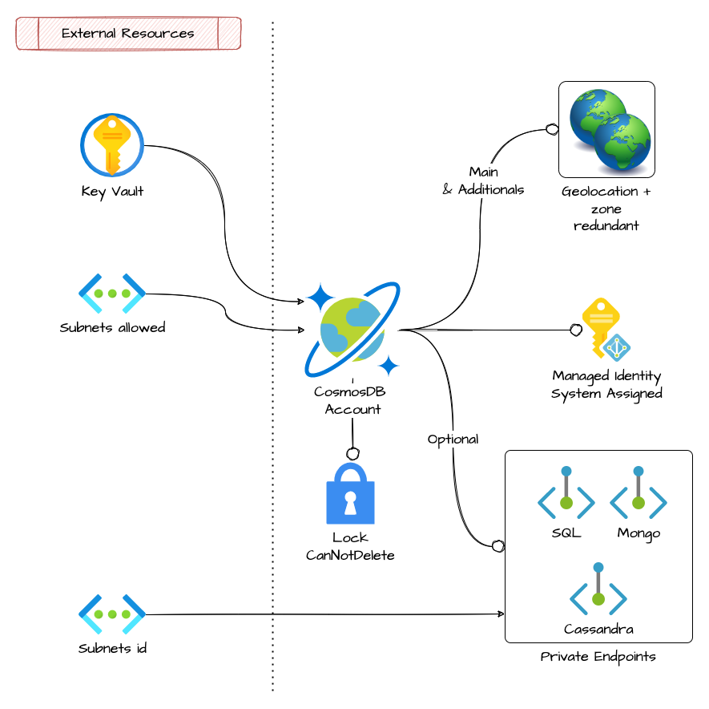

# Cosmos DB account

This module allow the setup of a cosmos db account

## Architecture



## How to use

```ts
module "cosmos_cgn" {
  source   = "git::https://github.com/pagopa/azurerm.git//cosmosdb_account?ref=v2.1.18"
  name     = format("%s-cosmos-cgn", local.project)
  location = var.location

  resource_group_name = data.azurerm_resource_group.cgn.name
  offer_type          = "Standard"
  kind                = "GlobalDocumentDB"

  main_geo_location_zone_redundant = false

  enable_free_tier          = false
  enable_automatic_failover = true

  consistency_policy = {
    consistency_level       = "Strong"
    max_interval_in_seconds = null
    max_staleness_prefix    = null
  }

  main_geo_location_location = "westeurope"

  additional_geo_locations = [
    {
      location          = "northeurope"
      failover_priority = 1
      zone_redundant    = true
    }
  ]

  backup_continuous_enabled = true

  is_virtual_network_filter_enabled = true

  ip_range = ""

  allowed_virtual_network_subnet_ids = [
    data.azurerm_subnet.fn3cgn.id
  ]

  # private endpoint
  private_endpoint_name    = format("%s-cosmos-cgn-sql-endpoint", local.project)
  private_endpoint_enabled = true
  subnet_id                = data.azurerm_subnet.private_endpoints_subnet.id
  private_dns_zone_ids     = [data.azurerm_private_dns_zone.privatelink_documents_azure_com.id]

  tags = var.tags

}

## Database
module "cgn_cosmos_db" {
  source              = "git::https://github.com/pagopa/azurerm.git//cosmosdb_sql_database?ref=v2.1.15"
  name                = "db"
  resource_group_name = data.azurerm_resource_group.cgn.name
  account_name        = module.cosmos_cgn.name
}

### Containers
locals {
  cgn_cosmosdb_containers = [


    {
      name               = "user-cgns"
      partition_key_path = "/fiscalCode"
      autoscale_settings = {
        max_throughput = 6000
      },
    },
    {
      name               = "user-eyca-cards"
      partition_key_path = "/fiscalCode"
      autoscale_settings = {
        max_throughput = 6000
      },
    },

  ]
}

module "cgn_cosmosdb_containers" {
  source   = "git::https://github.com/pagopa/azurerm.git//cosmosdb_sql_container?ref=v2.1.8"
  for_each = { for c in local.cgn_cosmosdb_containers : c.name => c }

  name                = each.value.name
  resource_group_name = data.azurerm_resource_group.cgn.name
  account_name        = module.cosmos_cgn.name
  database_name       = module.cgn_cosmos_db.name
  partition_key_path  = each.value.partition_key_path
  throughput          = lookup(each.value, "throughput", null)

  autoscale_settings = lookup(each.value, "autoscale_settings", null)

}
```

<!-- markdownlint-disable -->
<!-- BEGINNING OF PRE-COMMIT-TERRAFORM DOCS HOOK -->
## Requirements

| Name | Version |
|------|---------|
| <a name="requirement_terraform"></a> [terraform](#requirement\_terraform) | >= 1.1.0 |
| <a name="requirement_azurerm"></a> [azurerm](#requirement\_azurerm) | >= 2.80.0, <= 2.99.0 |

## Providers

| Name | Version |
|------|---------|
| <a name="provider_azurerm"></a> [azurerm](#provider\_azurerm) | 2.99.0 |

## Modules

No modules.

## Resources

| Name | Type |
|------|------|
| [azurerm_cosmosdb_account.this](https://registry.terraform.io/providers/hashicorp/azurerm/latest/docs/resources/cosmosdb_account) | resource |
| [azurerm_management_lock.this](https://registry.terraform.io/providers/hashicorp/azurerm/latest/docs/resources/management_lock) | resource |
| [azurerm_private_endpoint.cassandra](https://registry.terraform.io/providers/hashicorp/azurerm/latest/docs/resources/private_endpoint) | resource |
| [azurerm_private_endpoint.mongo](https://registry.terraform.io/providers/hashicorp/azurerm/latest/docs/resources/private_endpoint) | resource |
| [azurerm_private_endpoint.sql](https://registry.terraform.io/providers/hashicorp/azurerm/latest/docs/resources/private_endpoint) | resource |

## Inputs

| Name | Description | Type | Default | Required |
|------|-------------|------|---------|:--------:|
| <a name="input_additional_geo_locations"></a> [additional\_geo\_locations](#input\_additional\_geo\_locations) | Specifies a list of additional geo\_location resources, used to define where data should be replicated with the failover\_priority 0 specifying the primary location. | <pre>list(object({<br>    location          = string # The name of the Azure region to host replicated data.<br>    failover_priority = number # Required) The failover priority of the region. A failover priority of 0 indicates a write region. The maximum value for a failover priority = (total number of regions - 1). Failover priority values must be unique for each of the regions in which the database account exists. Changing this causes the location to be re-provisioned and cannot be changed for the location with failover priority 0.<br>    zone_redundant    = bool   # Should zone redundancy be enabled for this region? Defaults to false.<br>  }))</pre> | `[]` | no |
| <a name="input_allowed_virtual_network_subnet_ids"></a> [allowed\_virtual\_network\_subnet\_ids](#input\_allowed\_virtual\_network\_subnet\_ids) | The subnets id that are allowed to access this CosmosDB account. | `list(string)` | `[]` | no |
| <a name="input_backup_continuous_enabled"></a> [backup\_continuous\_enabled](#input\_backup\_continuous\_enabled) | Enable Continuous Backup | `bool` | `true` | no |
| <a name="input_backup_periodic_enabled"></a> [backup\_periodic\_enabled](#input\_backup\_periodic\_enabled) | Enable Periodic Backup | <pre>object({<br>    interval_in_minutes = string<br>    retention_in_hours  = string<br>    storage_redundancy  = string<br>  })</pre> | `null` | no |
| <a name="input_capabilities"></a> [capabilities](#input\_capabilities) | The capabilities which should be enabled for this Cosmos DB account. | `list(string)` | `[]` | no |
| <a name="input_consistency_policy"></a> [consistency\_policy](#input\_consistency\_policy) | Specifies a consistency\_policy resource, used to define the consistency policy for this CosmosDB account. | <pre>object({<br>    consistency_level       = string # The Consistency Level to use for this CosmosDB Account - can be either BoundedStaleness, Eventual, Session, Strong or ConsistentPrefix.<br>    max_interval_in_seconds = number # When used with the Bounded Staleness consistency level, this value represents the time amount of staleness (in seconds) tolerated. Accepted range for this value is 5 - 86400 (1 day). Defaults to 5. Required when consistency_level is set to BoundedStaleness.<br>    max_staleness_prefix    = number # When used with the Bounded Staleness consistency level, this value represents the number of stale requests tolerated. Accepted range for this value is 10 – 2147483647. Defaults to 100. Required when consistency_level is set to BoundedStaleness.<br>  })</pre> | <pre>{<br>  "consistency_level": "BoundedStaleness",<br>  "max_interval_in_seconds": 5,<br>  "max_staleness_prefix": 100<br>}</pre> | no |
| <a name="input_enable_automatic_failover"></a> [enable\_automatic\_failover](#input\_enable\_automatic\_failover) | Enable automatic fail over for this Cosmos DB account. | `bool` | `true` | no |
| <a name="input_enable_free_tier"></a> [enable\_free\_tier](#input\_enable\_free\_tier) | Enable Free Tier pricing option for this Cosmos DB account. Defaults to false. Changing this forces a new resource to be created. | `bool` | `true` | no |
| <a name="input_enable_multiple_write_locations"></a> [enable\_multiple\_write\_locations](#input\_enable\_multiple\_write\_locations) | Enable multi-master support for this Cosmos DB account. | `bool` | `false` | no |
| <a name="input_ip_range"></a> [ip\_range](#input\_ip\_range) | The set of IP addresses or IP address ranges in CIDR form to be included as the allowed list of client IP's for a given database account. | `string` | `null` | no |
| <a name="input_is_virtual_network_filter_enabled"></a> [is\_virtual\_network\_filter\_enabled](#input\_is\_virtual\_network\_filter\_enabled) | Enables virtual network filtering for this Cosmos DB account. | `bool` | `true` | no |
| <a name="input_key_vault_key_id"></a> [key\_vault\_key\_id](#input\_key\_vault\_key\_id) | (Optional) A versionless Key Vault Key ID for CMK encryption. Changing this forces a new resource to be created. When referencing an azurerm\_key\_vault\_key resource, use versionless\_id instead of id | `string` | `null` | no |
| <a name="input_kind"></a> [kind](#input\_kind) | Specifies the Kind of CosmosDB to create - possible values are GlobalDocumentDB and MongoDB. | `string` | n/a | yes |
| <a name="input_location"></a> [location](#input\_location) | Specifies the supported Azure location where the resource exists. Changing this forces a new resource to be created. | `string` | n/a | yes |
| <a name="input_lock_enable"></a> [lock\_enable](#input\_lock\_enable) | Apply lock to block accedentaly deletions. | `bool` | `false` | no |
| <a name="input_main_geo_location_location"></a> [main\_geo\_location\_location](#input\_main\_geo\_location\_location) | (Required) The name of the Azure region to host replicated data. | `string` | n/a | yes |
| <a name="input_main_geo_location_zone_redundant"></a> [main\_geo\_location\_zone\_redundant](#input\_main\_geo\_location\_zone\_redundant) | Should zone redundancy be enabled for main region? Set true for prod environments | `bool` | n/a | yes |
| <a name="input_mongo_server_version"></a> [mongo\_server\_version](#input\_mongo\_server\_version) | The Server Version of a MongoDB account. Possible values are 4.0, 3.6, and 3.2. | `string` | `null` | no |
| <a name="input_name"></a> [name](#input\_name) | (Required) Specifies the name of the CosmosDB Account. Changing this forces a new resource to be created. | `string` | n/a | yes |
| <a name="input_offer_type"></a> [offer\_type](#input\_offer\_type) | The CosmosDB account offer type. At the moment can only be set to Standard | `string` | `"Standard"` | no |
| <a name="input_private_dns_zone_ids"></a> [private\_dns\_zone\_ids](#input\_private\_dns\_zone\_ids) | Used only for private endpoints | `list(string)` | `[]` | no |
| <a name="input_private_endpoint_enabled"></a> [private\_endpoint\_enabled](#input\_private\_endpoint\_enabled) | Enable private endpoint | `bool` | `true` | no |
| <a name="input_private_endpoint_name"></a> [private\_endpoint\_name](#input\_private\_endpoint\_name) | Private endpoint name. If null it will assume the cosmosdb account name. | `string` | `null` | no |
| <a name="input_public_network_access_enabled"></a> [public\_network\_access\_enabled](#input\_public\_network\_access\_enabled) | Whether or not public network access is allowed for this CosmosDB account | `bool` | `false` | no |
| <a name="input_resource_group_name"></a> [resource\_group\_name](#input\_resource\_group\_name) | (Required) The name of the resource group in which the CosmosDB Account is created. Changing this forces a new resource to be created. | `string` | n/a | yes |
| <a name="input_subnet_id"></a> [subnet\_id](#input\_subnet\_id) | Used only for private endpoints | `string` | `null` | no |
| <a name="input_tags"></a> [tags](#input\_tags) | n/a | `map(any)` | n/a | yes |

## Outputs

| Name | Description |
|------|-------------|
| <a name="output_connection_strings"></a> [connection\_strings](#output\_connection\_strings) | n/a |
| <a name="output_endpoint"></a> [endpoint](#output\_endpoint) | The endpoint used to connect to the CosmosDB account. |
| <a name="output_id"></a> [id](#output\_id) | The id of the CosmosDB account. |
| <a name="output_lock_id"></a> [lock\_id](#output\_lock\_id) | n/a |
| <a name="output_name"></a> [name](#output\_name) | The name of the CosmosDB created. |
| <a name="output_primary_key"></a> [primary\_key](#output\_primary\_key) | n/a |
| <a name="output_primary_master_key"></a> [primary\_master\_key](#output\_primary\_master\_key) | n/a |
| <a name="output_primary_readonly_master_key"></a> [primary\_readonly\_master\_key](#output\_primary\_readonly\_master\_key) | n/a |
| <a name="output_principal_id"></a> [principal\_id](#output\_principal\_id) | n/a |
| <a name="output_read_endpoints"></a> [read\_endpoints](#output\_read\_endpoints) | A list of read endpoints available for this CosmosDB account. |
| <a name="output_secondary_key"></a> [secondary\_key](#output\_secondary\_key) | n/a |
| <a name="output_write_endpoints"></a> [write\_endpoints](#output\_write\_endpoints) | A list of write endpoints available for this CosmosDB account. |
<!-- END OF PRE-COMMIT-TERRAFORM DOCS HOOK -->
