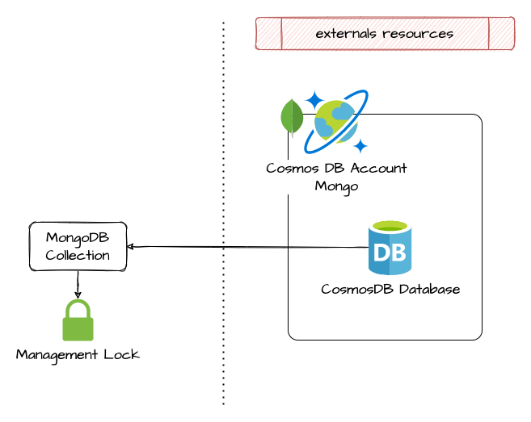

# MongoDB Collection

This module allow the creation of a collection inside a MongoDB database

## Architecture



## How to use it

```ts

# The resource group
resource "azurerm_resource_group" "mongodb_rg" {
  name     = format("%s-cosmosdb-mongodb-rg", local.project)
  location = var.location

  tags = var.tags
}

locals {
  base_capabilities = [
    "EnableMongo"
  ]
  cosmosdb_mongodb_enable_serverless = contains(var.cosmosdb_mongodb_extra_capabilities, "EnableServerless")
}

# cosmosdb-Mongo subnet
module "cosmosdb_mongodb_snet" {
  source               = "git::https://github.com/pagopa/azurerm.git//subnet?ref=v1.0.58"
  name                 = format("%s-cosmosb-mongodb-snet", local.project)
  resource_group_name  = azurerm_resource_group.rg_vnet.name
  virtual_network_name = module.vnet.name
  address_prefixes     = var.cidr_subnet_cosmosdb_mongodb

  enforce_private_link_endpoint_network_policies = true
  service_endpoints                              = ["Microsoft.Web"]
}

module "cosmosdb_account_mongodb" {
  source = "git::https://github.com/pagopa/azurerm.git//cosmosdb?ref=v2.0.19"

  name                 = format("%s-cosmosdb-mongodb-account", local.project)
  location             = azurerm_resource_group.mongodb_rg.location
  resource_group_name  = azurerm_resource_group.mongodb_rg.name
  offer_type           = var.cosmosdb_mongodb_offer_type
  kind                 = "MongoDB"
  capabilities         = concat(["EnableMongo"], var.cosmosdb_mongodb_extra_capabilities)
  mongo_server_version = "4.0"

  public_network_access_enabled     = var.env_short == "p" ? false : var.cosmosdb_mongodb_public_network_access_enabled
  private_endpoint_enabled          = var.cosmosdb_mongodb_private_endpoint_enabled
  subnet_id                         = module.cosmosdb_mongodb_snet.id
  private_dns_zone_ids              = var.cosmosdb_mongodb_private_endpoint_enabled ? [azurerm_private_dns_zone.privatelink_mongo_cosmos_azure_com.id] : []
  is_virtual_network_filter_enabled = true

  consistency_policy = var.cosmosdb_mongodb_consistency_policy

  main_geo_location_location       = azurerm_resource_group.mongodb_rg.location
  main_geo_location_zone_redundant = var.cosmosdb_mongodb_main_geo_location_zone_redundant

  additional_geo_locations = var.cosmosdb_mongodb_additional_geo_locations

  backup_continuous_enabled = true

  lock_enable = true

  tags = var.tags
}

resource "azurerm_cosmosdb_mongo_database" "cosmosdb_mongodb_database" {
  name                = "db"
  resource_group_name = azurerm_resource_group.mongodb_rg.name
  account_name        = module.cosmosdb_account_mongodb.name

  throughput = var.cosmosdb_mongodb_enable_autoscaling || local.cosmosdb_mongodb_enable_serverless ? null : var.cosmosdb_mongodb_throughput

  dynamic "autoscale_settings" {
    for_each = var.cosmosdb_mongodb_enable_autoscaling && !local.cosmosdb_mongodb_enable_serverless ? [""] : []
    content {
      max_throughput = var.cosmosdb_mongodb_max_throughput
    }
  }
}

module "mongdb_collection_name" {
  source = "git::https://github.com/pagopa/azurerm.git//cosmosdb_mongodb_collection?ref=v2.X.X"

  name                = "collectionName"
  resource_group_name = azurerm_resource_group.mongodb_rg.name

  cosmosdb_mongo_account_name  = module.cosmosdb_account_mongodb.name
  cosmosdb_mongo_database_name = azurerm_cosmosdb_mongo_database.cosmosdb_account_mongodb.name

  indexes = [{
    keys   = ["_id"]
    unique = true
    },
    {
      keys   = ["key1", "key2", "key3"]
      unique = true
    },
    {
      keys   = ["key4"]
      unique = false
    }
  ]

  lock_enable = true
}

```

<!-- markdownlint-disable -->
<!-- BEGINNING OF PRE-COMMIT-TERRAFORM DOCS HOOK -->
## Modules

No modules.

## Resources

| Name | Type |
|------|------|
| [azurerm_cosmosdb_mongo_collection.this](https://registry.terraform.io/providers/hashicorp/azurerm/latest/docs/resources/cosmosdb_mongo_collection) | resource |
| [azurerm_management_lock.this](https://registry.terraform.io/providers/hashicorp/azurerm/latest/docs/resources/management_lock) | resource |

## Inputs

| Name | Description | Type | Default | Required |
|------|-------------|------|---------|:--------:|
| <a name="input_analytical_storage_ttl"></a> [analytical\_storage\_ttl](#input\_analytical\_storage\_ttl) | The default time to live of Analytical Storage for this Mongo Collection. If present and the value is set to -1, it is equal to infinity, and items don’t expire by default. If present and the value is set to some number n – items will expire n seconds after their last modified time. | `number` | `null` | no |
| <a name="input_cosmosdb_mongo_account_name"></a> [cosmosdb\_mongo\_account\_name](#input\_cosmosdb\_mongo\_account\_name) | The name of the Cosmos DB Mongo Account in which the Cosmos DB Mongo Database exists. Changing this forces a new resource to be created. | `string` | n/a | yes |
| <a name="input_cosmosdb_mongo_database_name"></a> [cosmosdb\_mongo\_database\_name](#input\_cosmosdb\_mongo\_database\_name) | The name of the Cosmos DB Mongo Database in which the Cosmos DB Mongo Collection is created. Changing this forces a new resource to be created. | `string` | n/a | yes |
| <a name="input_default_ttl_seconds"></a> [default\_ttl\_seconds](#input\_default\_ttl\_seconds) | The default Time To Live in seconds. If the value is -1 or 0, items are not automatically expired. | `number` | `0` | no |
| <a name="input_indexes"></a> [indexes](#input\_indexes) | One or more indexes. An index with an "\_id" key must be specified. | <pre>list(object({<br>    keys   = list(string)<br>    unique = bool<br>  }))</pre> | n/a | yes |
| <a name="input_lock_enable"></a> [lock\_enable](#input\_lock\_enable) | Apply lock to block accidental deletions. | `bool` | `false` | no |
| <a name="input_max_throughput"></a> [max\_throughput](#input\_max\_throughput) | It will activate the autoscale mode setting the maximum throughput of the MongoDB collection (RU/s). Must be between 4,000 and 1,000,000. Must be set in increments of 1,000. Conflicts with throughput. Switching between autoscale and manual throughput is not supported via Terraform and must be completed via the Azure Portal and refreshed. | `number` | `null` | no |
| <a name="input_name"></a> [name](#input\_name) | Specifies the name of the Cosmos DB Mongo Collection. Changing this forces a new resource to be created. | `string` | n/a | yes |
| <a name="input_resource_group_name"></a> [resource\_group\_name](#input\_resource\_group\_name) | The name of the resource group in which the Cosmos DB Mongo Collection is created. Changing this forces a new resource to be created. | `string` | n/a | yes |
| <a name="input_shard_key"></a> [shard\_key](#input\_shard\_key) | The name of the key to partition on for sharding. There must not be any other unique index keys. | `string` | `null` | no |
| <a name="input_throughput"></a> [throughput](#input\_throughput) | The throughput of the MongoDB collection (RU/s). Must be set in increments of 100. The minimum value is 400. This must be set upon database creation otherwise it cannot be updated without a manual terraform destroy-apply. | `number` | `null` | no |
| <a name="input_timeout_create"></a> [timeout\_create](#input\_timeout\_create) | (Defaults to 30 minutes) Used when creating the CosmosDB Mongo Collection. | `string` | `null` | no |
| <a name="input_timeout_delete"></a> [timeout\_delete](#input\_timeout\_delete) | (Defaults to 30 minutes) Used when deleting the CosmosDB Mongo Collection. | `string` | `null` | no |
| <a name="input_timeout_read"></a> [timeout\_read](#input\_timeout\_read) | (Defaults to 5 minutes) Used when retrieving the CosmosDB Mongo Collection. | `string` | `null` | no |
| <a name="input_timeout_update"></a> [timeout\_update](#input\_timeout\_update) | (Defaults to 30 minutes) Used when updating the CosmosDB Mongo Collection. | `string` | `null` | no |

## Outputs

| Name | Description |
|------|-------------|
| <a name="output_id"></a> [id](#output\_id) | The id of the collection |
| <a name="output_lock_id"></a> [lock\_id](#output\_lock\_id) | n/a |
<!-- END OF PRE-COMMIT-TERRAFORM DOCS HOOK -->
