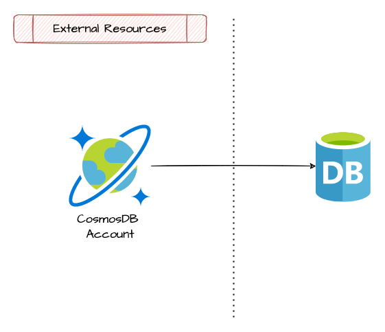

# Cosmos DB sql database

This module allow the setup of a cosmos db sql database

## Architecture



## How to use

```ts
module "cosmos_cgn" {
  source   = "git::https://github.com/pagopa/azurerm.git//cosmosdb_account?ref=v2.1.18"
  name     = format("%s-cosmos-cgn", local.project)
  location = var.location

  resource_group_name = data.azurerm_resource_group.cgn.name
  offer_type          = "Standard"
  kind                = "GlobalDocumentDB"

  main_geo_location_zone_redundant = false

  enable_free_tier          = false
  enable_automatic_failover = true

  consistency_policy = {
    consistency_level       = "Strong"
    max_interval_in_seconds = null
    max_staleness_prefix    = null
  }

  main_geo_location_location = "westeurope"

  additional_geo_locations = [
    {
      location          = "northeurope"
      failover_priority = 1
      zone_redundant    = true
    }
  ]

  backup_continuous_enabled = true

  is_virtual_network_filter_enabled = true

  ip_range = ""

  allowed_virtual_network_subnet_ids = [
    data.azurerm_subnet.fn3cgn.id
  ]

  # private endpoint
  private_endpoint_name    = format("%s-cosmos-cgn-sql-endpoint", local.project)
  private_endpoint_enabled = true
  subnet_id                = data.azurerm_subnet.private_endpoints_subnet.id
  private_dns_zone_ids     = [data.azurerm_private_dns_zone.privatelink_documents_azure_com.id]

  tags = var.tags

}

## Database
module "cgn_cosmos_db" {
  source              = "git::https://github.com/pagopa/azurerm.git//cosmosdb_sql_database?ref=v2.1.15"
  name                = "db"
  resource_group_name = data.azurerm_resource_group.cgn.name
  account_name        = module.cosmos_cgn.name
}

### Containers
locals {
  cgn_cosmosdb_containers = [


    {
      name               = "user-cgns"
      partition_key_path = "/fiscalCode"
      autoscale_settings = {
        max_throughput = 6000
      },
    },
    {
      name               = "user-eyca-cards"
      partition_key_path = "/fiscalCode"
      autoscale_settings = {
        max_throughput = 6000
      },
    },

  ]
}

module "cgn_cosmosdb_containers" {
  source   = "git::https://github.com/pagopa/azurerm.git//cosmosdb_sql_container?ref=v2.1.8"
  for_each = { for c in local.cgn_cosmosdb_containers : c.name => c }

  name                = each.value.name
  resource_group_name = data.azurerm_resource_group.cgn.name
  account_name        = module.cosmos_cgn.name
  database_name       = module.cgn_cosmos_db.name
  partition_key_path  = each.value.partition_key_path
  throughput          = lookup(each.value, "throughput", null)

  autoscale_settings = lookup(each.value, "autoscale_settings", null)

}
```

<!-- markdownlint-disable -->
<!-- BEGINNING OF PRE-COMMIT-TERRAFORM DOCS HOOK -->
## Requirements

| Name | Version |
|------|---------|
| <a name="requirement_terraform"></a> [terraform](#requirement\_terraform) | >= 1.1.0 |
| <a name="requirement_azurerm"></a> [azurerm](#requirement\_azurerm) | >= 2.80.0, <= 2.99.0 |

## Providers

| Name | Version |
|------|---------|
| <a name="provider_azurerm"></a> [azurerm](#provider\_azurerm) | 2.99.0 |

## Modules

No modules.

## Resources

| Name | Type |
|------|------|
| [azurerm_cosmosdb_sql_database.this](https://registry.terraform.io/providers/hashicorp/azurerm/latest/docs/resources/cosmosdb_sql_database) | resource |

## Inputs

| Name | Description | Type | Default | Required |
|------|-------------|------|---------|:--------:|
| <a name="input_account_name"></a> [account\_name](#input\_account\_name) | The name of the Cosmos DB SQL Database to create the table within. | `string` | n/a | yes |
| <a name="input_name"></a> [name](#input\_name) | The name of the Cosmos DB SQL Database | `string` | n/a | yes |
| <a name="input_resource_group_name"></a> [resource\_group\_name](#input\_resource\_group\_name) | The name of the resource group in which the Cosmos DB SQL Database is created. | `string` | n/a | yes |
| <a name="input_throughput"></a> [throughput](#input\_throughput) | The throughput of SQL database (RU/s). | `number` | `null` | no |

## Outputs

| Name | Description |
|------|-------------|
| <a name="output_id"></a> [id](#output\_id) | n/a |
| <a name="output_name"></a> [name](#output\_name) | n/a |
<!-- END OF PRE-COMMIT-TERRAFORM DOCS HOOK -->
