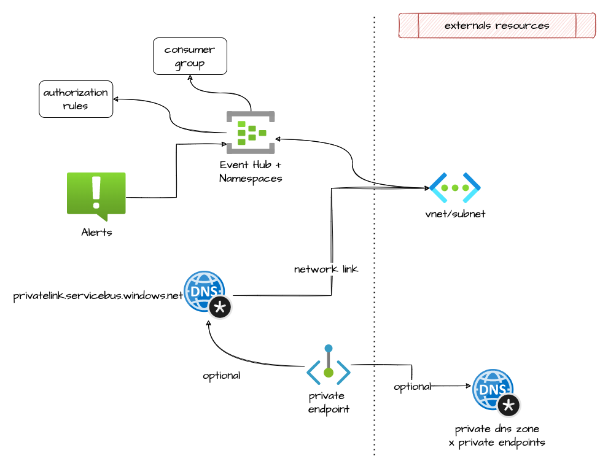

# EventHub

This module allow the creation of a EventHub

## Architecture



## How to use it

```ts
resource "azurerm_resource_group" "event_rg" {
  name     = "${local.project}-event-rg"
  location = var.location

  tags = var.tags
}

module "eventhub_snet" {
  source                                         = "git::https://github.com/pagopa/azurerm.git//subnet?ref=v2.18.6"
  name                                           = "${local.project}-eventhub-snet"
  address_prefixes                               = var.cidr_subnet_eventhub
  resource_group_name                            = azurerm_resource_group.rg_vnet.name
  virtual_network_name                           = module.vnet.name
  service_endpoints                              = ["Microsoft.EventHub"]
  enforce_private_link_endpoint_network_policies = true
}

module "event_hub" {
  source                   = "git::https://github.com/pagopa/azurerm.git//eventhub?ref=v2.18.7"
  name                     = "${local.project}-eventhub-ns"
  location                 = var.location
  resource_group_name      = azurerm_resource_group.event_rg.name
  auto_inflate_enabled     = var.eventhub_auto_inflate_enabled
  sku                      = var.eventhub_sku_name
  capacity                 = var.eventhub_capacity
  maximum_throughput_units = var.eventhub_maximum_throughput_units
  zone_redundant           = var.eventhub_zone_redundant

  virtual_network_ids = [module.vnet.id]
  subnet_id           = module.eventhub_snet.id

  private_dns_zone_record_A_name = null

  eventhubs = var.eventhubs

  network_rulesets = [
    {
      default_action       = "Deny",
      virtual_network_rule = [],
      ip_rule              = var.eventhub_ip_rules
    }
  ]

  private_dns_zones = {
    id   = [azurerm_private_dns_zone.privatelink_servicebus_windows_net.id]
    name = [azurerm_private_dns_zone.privatelink_servicebus_windows_net.name]
  }

  alerts_enabled = var.eventhub_alerts_enabled
  metric_alerts  = var.eventhub_metric_alerts
  action = [
    {
      action_group_id    = azurerm_monitor_action_group.slack.id
      webhook_properties = null
    },
    {
      action_group_id    = azurerm_monitor_action_group.email.id
      webhook_properties = null
    }
  ]

  tags = var.tags
}

#tfsec:ignore:AZU023
resource "azurerm_key_vault_secret" "event_hub_keys" {
  for_each = module.event_hub.key_ids

  name         = "eventhub-${replace(each.key, ".", "-")}-key"
  value        = module.event_hub.keys[each.key].primary_key
  content_type = "text/plain"

  key_vault_id = module.key_vault.id
}

#tfsec:ignore:AZU023
resource "azurerm_key_vault_secret" "event_hub_connection_strings" {
  for_each = module.event_hub.key_ids

  name         = "eventhub-${replace(each.key, ".", "-")}-connection-string"
  value        = module.event_hub.keys[each.key].primary_connection_string
  content_type = "text/plain"

  key_vault_id = module.key_vault.id
}

```

<!-- markdownlint-disable -->
<!-- BEGINNING OF PRE-COMMIT-TERRAFORM DOCS HOOK -->
## Requirements

| Name | Version |
|------|---------|
| <a name="requirement_terraform"></a> [terraform](#requirement\_terraform) | >= 1.1.0 |
| <a name="requirement_azurerm"></a> [azurerm](#requirement\_azurerm) | >= 2.80.0, <= 2.99.0 |

## Providers

| Name | Version |
|------|---------|
| <a name="provider_azurerm"></a> [azurerm](#provider\_azurerm) | >= 2.80.0, <= 2.99.0 |

## Modules

No modules.

## Resources

| Name | Type |
|------|------|
| [azurerm_eventhub.events](https://registry.terraform.io/providers/hashicorp/azurerm/latest/docs/resources/eventhub) | resource |
| [azurerm_eventhub_authorization_rule.events](https://registry.terraform.io/providers/hashicorp/azurerm/latest/docs/resources/eventhub_authorization_rule) | resource |
| [azurerm_eventhub_consumer_group.events](https://registry.terraform.io/providers/hashicorp/azurerm/latest/docs/resources/eventhub_consumer_group) | resource |
| [azurerm_eventhub_namespace.this](https://registry.terraform.io/providers/hashicorp/azurerm/latest/docs/resources/eventhub_namespace) | resource |
| [azurerm_monitor_metric_alert.this](https://registry.terraform.io/providers/hashicorp/azurerm/latest/docs/resources/monitor_metric_alert) | resource |
| [azurerm_private_dns_a_record.private_dns_a_record_eventhub](https://registry.terraform.io/providers/hashicorp/azurerm/latest/docs/resources/private_dns_a_record) | resource |
| [azurerm_private_dns_zone.eventhub](https://registry.terraform.io/providers/hashicorp/azurerm/latest/docs/resources/private_dns_zone) | resource |
| [azurerm_private_dns_zone_virtual_network_link.eventhub](https://registry.terraform.io/providers/hashicorp/azurerm/latest/docs/resources/private_dns_zone_virtual_network_link) | resource |
| [azurerm_private_endpoint.eventhub](https://registry.terraform.io/providers/hashicorp/azurerm/latest/docs/resources/private_endpoint) | resource |

## Inputs

| Name | Description | Type | Default | Required |
|------|-------------|------|---------|:--------:|
| <a name="input_action"></a> [action](#input\_action) | The ID of the Action Group and optional map of custom string properties to include with the post webhook operation. | <pre>set(object(<br>    {<br>      action_group_id    = string<br>      webhook_properties = map(string)<br>    }<br>  ))</pre> | `[]` | no |
| <a name="input_alerts_enabled"></a> [alerts\_enabled](#input\_alerts\_enabled) | Should Metrics Alert be enabled? | `bool` | `true` | no |
| <a name="input_auto_inflate_enabled"></a> [auto\_inflate\_enabled](#input\_auto\_inflate\_enabled) | Is Auto Inflate enabled for the EventHub Namespace? | `bool` | `false` | no |
| <a name="input_capacity"></a> [capacity](#input\_capacity) | Specifies the Capacity / Throughput Units for a Standard SKU namespace. | `number` | `null` | no |
| <a name="input_eventhubs"></a> [eventhubs](#input\_eventhubs) | A list of event hubs to add to namespace. | <pre>list(object({<br>    name              = string<br>    partitions        = number<br>    message_retention = number<br>    consumers         = list(string)<br>    keys = list(object({<br>      name   = string<br>      listen = bool<br>      send   = bool<br>      manage = bool<br>    }))<br>  }))</pre> | `[]` | no |
| <a name="input_location"></a> [location](#input\_location) | n/a | `string` | n/a | yes |
| <a name="input_maximum_throughput_units"></a> [maximum\_throughput\_units](#input\_maximum\_throughput\_units) | Specifies the maximum number of throughput units when Auto Inflate is Enabled | `number` | `null` | no |
| <a name="input_metric_alerts"></a> [metric\_alerts](#input\_metric\_alerts) | Map of name = criteria objects | <pre>map(object({<br>    # criteria.*.aggregation to be one of [Average Count Minimum Maximum Total]<br>    aggregation = string<br>    metric_name = string<br>    description = string<br>    # criteria.0.operator to be one of [Equals NotEquals GreaterThan GreaterThanOrEqual LessThan LessThanOrEqual]<br>    operator  = string<br>    threshold = number<br>    # Possible values are PT1M, PT5M, PT15M, PT30M and PT1H<br>    frequency = string<br>    # Possible values are PT1M, PT5M, PT15M, PT30M, PT1H, PT6H, PT12H and P1D.<br>    window_size = string<br><br>    dimension = list(object(<br>      {<br>        name     = string<br>        operator = string<br>        values   = list(string)<br>      }<br>    ))<br>  }))</pre> | `{}` | no |
| <a name="input_name"></a> [name](#input\_name) | Eventhub namespace description. | `string` | n/a | yes |
| <a name="input_network_rulesets"></a> [network\_rulesets](#input\_network\_rulesets) | n/a | <pre>list(object({<br>    default_action = string<br>    virtual_network_rule = list(object({<br>      subnet_id                                       = string<br>      ignore_missing_virtual_network_service_endpoint = bool<br>    }))<br>    ip_rule = list(object({<br>      ip_mask = string<br>      action  = string<br>    }))<br>  }))</pre> | `[]` | no |
| <a name="input_private_dns_zone_record_A_name"></a> [private\_dns\_zone\_record\_A\_name](#input\_private\_dns\_zone\_record\_A\_name) | Name of the A record in the private dns zone | `string` | `"eventhub"` | no |
| <a name="input_private_dns_zone_resource_group"></a> [private\_dns\_zone\_resource\_group](#input\_private\_dns\_zone\_resource\_group) | Name of the resource group record in the private dns zone | `string` | `null` | no |
| <a name="input_private_dns_zones"></a> [private\_dns\_zones](#input\_private\_dns\_zones) | Private DNS Zones where the private endpoint will be created | <pre>object({<br>    id   = list(string)<br>    name = list(string)<br>  })</pre> | <pre>{<br>  "id": [],<br>  "name": []<br>}</pre> | no |
| <a name="input_resource_group_name"></a> [resource\_group\_name](#input\_resource\_group\_name) | Resource Group | `string` | n/a | yes |
| <a name="input_sku"></a> [sku](#input\_sku) | Defines which tier to use. Valid options are Basic and Standard. | `string` | n/a | yes |
| <a name="input_subnet_id"></a> [subnet\_id](#input\_subnet\_id) | The id of the subnet that will be used for the eventhub. | `string` | `null` | no |
| <a name="input_tags"></a> [tags](#input\_tags) | n/a | `map(any)` | n/a | yes |
| <a name="input_virtual_network_ids"></a> [virtual\_network\_ids](#input\_virtual\_network\_ids) | The IDs of the Virtual Network that should be linked to the DNS Zone. | `list(string)` | n/a | yes |
| <a name="input_zone_redundant"></a> [zone\_redundant](#input\_zone\_redundant) | Specifies if the EventHub Namespace should be Zone Redundant (created across Availability Zones). | `bool` | `false` | no |

## Outputs

| Name | Description |
|------|-------------|
| <a name="output_hub_ids"></a> [hub\_ids](#output\_hub\_ids) | Map of hubs and their ids. |
| <a name="output_key_ids"></a> [key\_ids](#output\_key\_ids) | List of key ids. |
| <a name="output_keys"></a> [keys](#output\_keys) | Map of hubs with keys => primary\_key / secondary\_key mapping. |
| <a name="output_namespace_id"></a> [namespace\_id](#output\_namespace\_id) | Id of Event Hub Namespace. |
| <a name="output_private_dns_zone"></a> [private\_dns\_zone](#output\_private\_dns\_zone) | ID of the private DNS zone which resolves the name of the Private Endpoint used to connect to EventHub |
<!-- END OF PRE-COMMIT-TERRAFORM DOCS HOOK -->
