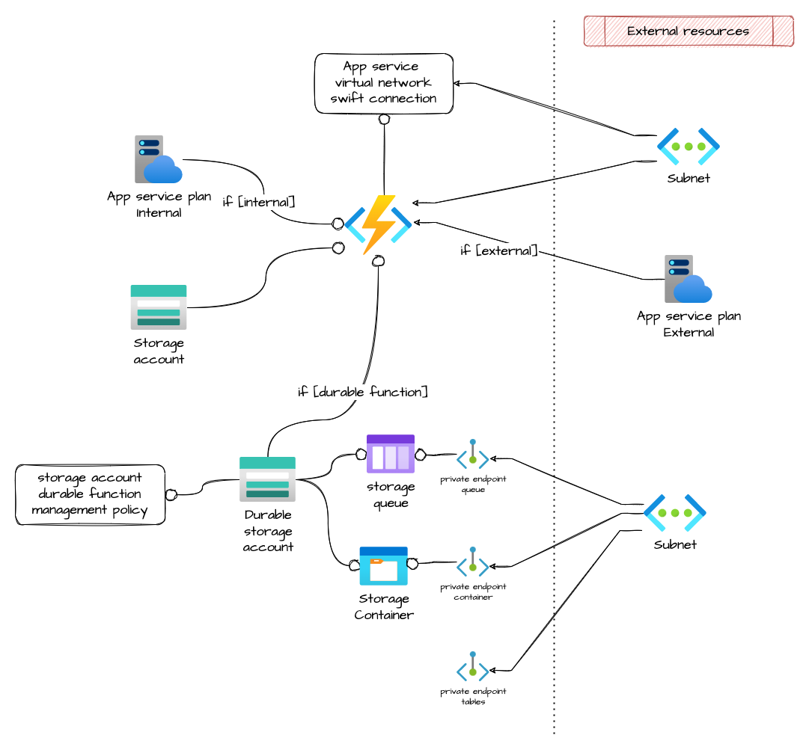

# Azure function app

Module that allows the creation of an Azure function app.

## Architecture



## How to use it

```ts
module "io_sign_issuer_func" {
  source = "git::https://github.com/pagopa/azurerm.git//function_app?ref=v3.2.6"

  name                                     = format("%s-func", local.project)
  location                                 = azurerm_resource_group.backend_rg.location
  resource_group_name                      = azurerm_resource_group.backend_rg.name
  subnet_id                                = module.subnet.id
  application_insights_instrumentation_key = data.azurerm_application_insights.monitor.instrumentation_key
  system_identity                          = true

  tags = var.tags
}
```

<!-- markdownlint-disable -->
<!-- BEGINNING OF PRE-COMMIT-TERRAFORM DOCS HOOK -->
## Requirements

| Name | Version |
|------|---------|
| <a name="requirement_terraform"></a> [terraform](#requirement\_terraform) | >= 1.1.0 |
| <a name="requirement_azurerm"></a> [azurerm](#requirement\_azurerm) | >= 2.80.0 |

## Providers

| Name | Version |
|------|---------|
| <a name="provider_azurerm"></a> [azurerm](#provider\_azurerm) | 2.99.0 |

## Modules

| Name | Source | Version |
|------|--------|---------|
| <a name="module_storage_account"></a> [storage\_account](#module\_storage\_account) | git::https://github.com/pagopa/azurerm.git//storage_account | v2.7.0 |
| <a name="module_storage_account_durable_function"></a> [storage\_account\_durable\_function](#module\_storage\_account\_durable\_function) | git::https://github.com/pagopa/azurerm.git//storage_account | v2.7.0 |
| <a name="module_storage_account_durable_function_management_policy"></a> [storage\_account\_durable\_function\_management\_policy](#module\_storage\_account\_durable\_function\_management\_policy) | git::https://github.com/pagopa/azurerm.git//storage_management_policy | v3.6.1 |

## Resources

| Name | Type |
|------|------|
| [azurerm_app_service_plan.this](https://registry.terraform.io/providers/hashicorp/azurerm/latest/docs/resources/app_service_plan) | resource |
| [azurerm_app_service_virtual_network_swift_connection.this](https://registry.terraform.io/providers/hashicorp/azurerm/latest/docs/resources/app_service_virtual_network_swift_connection) | resource |
| [azurerm_function_app.this](https://registry.terraform.io/providers/hashicorp/azurerm/latest/docs/resources/function_app) | resource |
| [azurerm_monitor_metric_alert.function_app_health_check](https://registry.terraform.io/providers/hashicorp/azurerm/latest/docs/resources/monitor_metric_alert) | resource |
| [azurerm_private_endpoint.blob](https://registry.terraform.io/providers/hashicorp/azurerm/latest/docs/resources/private_endpoint) | resource |
| [azurerm_private_endpoint.queue](https://registry.terraform.io/providers/hashicorp/azurerm/latest/docs/resources/private_endpoint) | resource |
| [azurerm_private_endpoint.table](https://registry.terraform.io/providers/hashicorp/azurerm/latest/docs/resources/private_endpoint) | resource |
| [azurerm_storage_container.internal_container](https://registry.terraform.io/providers/hashicorp/azurerm/latest/docs/resources/storage_container) | resource |
| [azurerm_storage_queue.internal_queue](https://registry.terraform.io/providers/hashicorp/azurerm/latest/docs/resources/storage_queue) | resource |
| [azurerm_function_app_host_keys.this](https://registry.terraform.io/providers/hashicorp/azurerm/latest/docs/data-sources/function_app_host_keys) | data source |

## Inputs

| Name | Description | Type | Default | Required |
|------|-------------|------|---------|:--------:|
| <a name="input_action"></a> [action](#input\_action) | The ID of the Action Group and optional map of custom string properties to include with the post webhook operation. | <pre>set(object(<br>    {<br>      action_group_id    = string<br>      webhook_properties = map(string)<br>    }<br>  ))</pre> | `[]` | no |
| <a name="input_allowed_ips"></a> [allowed\_ips](#input\_allowed\_ips) | The IP Address used for this IP Restriction in CIDR notation | `list(string)` | `[]` | no |
| <a name="input_allowed_subnets"></a> [allowed\_subnets](#input\_allowed\_subnets) | List of subnet ids, The Virtual Network Subnet ID used for this IP Restriction. | `list(string)` | `[]` | no |
| <a name="input_always_on"></a> [always\_on](#input\_always\_on) | (Optional) Should the app be loaded at all times? Defaults to null. | `bool` | `null` | no |
| <a name="input_app_service_plan_id"></a> [app\_service\_plan\_id](#input\_app\_service\_plan\_id) | The external app service plan id to associate to the function. If null a new plan is created, use app\_service\_plan\_info to configure it. | `string` | `null` | no |
| <a name="input_app_service_plan_info"></a> [app\_service\_plan\_info](#input\_app\_service\_plan\_info) | Allows to configurate the internal service plan | <pre>object({<br>    kind                         = string # The kind of the App Service Plan to create. Possible values are Windows (also available as App), Linux, elastic (for Premium Consumption) and FunctionApp (for a Consumption Plan).<br>    sku_tier                     = string # Specifies the plan's pricing tier.<br>    sku_size                     = string # Specifies the plan's instance size.<br>    maximum_elastic_worker_count = number # The maximum number of total workers allowed for this ElasticScaleEnabled App Service Plan.<br>  })</pre> | <pre>{<br>  "kind": "elastic",<br>  "maximum_elastic_worker_count": 1,<br>  "sku_size": "EP1",<br>  "sku_tier": "ElasticPremium"<br>}</pre> | no |
| <a name="input_app_service_plan_name"></a> [app\_service\_plan\_name](#input\_app\_service\_plan\_name) | Name of the app service plan. If null it will be 'computed' | `string` | `null` | no |
| <a name="input_app_settings"></a> [app\_settings](#input\_app\_settings) | n/a | `map(any)` | `{}` | no |
| <a name="input_application_insights_instrumentation_key"></a> [application\_insights\_instrumentation\_key](#input\_application\_insights\_instrumentation\_key) | Application insights instrumentation key | `string` | n/a | yes |
| <a name="input_cors"></a> [cors](#input\_cors) | n/a | <pre>object({<br>    allowed_origins = list(string) # A list of origins which should be able to make cross-origin calls. * can be used to allow all calls.<br>  })</pre> | `null` | no |
| <a name="input_domain"></a> [domain](#input\_domain) | Specifies the domain of the Function App. | `string` | `null` | no |
| <a name="input_enable_healthcheck"></a> [enable\_healthcheck](#input\_enable\_healthcheck) | Enable the healthcheck alert. Default is true | `bool` | `true` | no |
| <a name="input_export_keys"></a> [export\_keys](#input\_export\_keys) | n/a | `bool` | `false` | no |
| <a name="input_health_check_maxpingfailures"></a> [health\_check\_maxpingfailures](#input\_health\_check\_maxpingfailures) | Max ping failures allowed | `number` | `10` | no |
| <a name="input_health_check_path"></a> [health\_check\_path](#input\_health\_check\_path) | Path which will be checked for this function app health. | `string` | `null` | no |
| <a name="input_healthcheck_threshold"></a> [healthcheck\_threshold](#input\_healthcheck\_threshold) | The healthcheck threshold. If metric average is under this value, the alert will be triggered. Default is 50 | `number` | `50` | no |
| <a name="input_https_only"></a> [https\_only](#input\_https\_only) | (Required) Can the Function App only be accessed via HTTPS?. Defaults true | `bool` | `true` | no |
| <a name="input_internal_storage"></a> [internal\_storage](#input\_internal\_storage) | n/a | <pre>object({<br>    enable                     = bool<br>    private_endpoint_subnet_id = string<br>    private_dns_zone_blob_ids  = list(string)<br>    private_dns_zone_queue_ids = list(string)<br>    private_dns_zone_table_ids = list(string)<br>    queues                     = list(string) # Queues names<br>    containers                 = list(string) # Containers names<br>    blobs_retention_days       = number<br>  })</pre> | <pre>{<br>  "blobs_retention_days": 1,<br>  "containers": [],<br>  "enable": false,<br>  "private_dns_zone_blob_ids": [],<br>  "private_dns_zone_queue_ids": [],<br>  "private_dns_zone_table_ids": [],<br>  "private_endpoint_subnet_id": "dummy",<br>  "queues": []<br>}</pre> | no |
| <a name="input_linux_fx_version"></a> [linux\_fx\_version](#input\_linux\_fx\_version) | (Required) Linux App Framework and version for the AppService, e.g. DOCKER\|(golang:latest). Use null if function app is on windows | `string` | n/a | yes |
| <a name="input_location"></a> [location](#input\_location) | n/a | `string` | n/a | yes |
| <a name="input_name"></a> [name](#input\_name) | (Required) Specifies the name of the Function App. Changing this forces a new resource to be created. | `string` | n/a | yes |
| <a name="input_os_type"></a> [os\_type](#input\_os\_type) | (Optional) A string indicating the Operating System type for this function app. This value will be linux for Linux derivatives, or an empty string for Windows (default). When set to linux you must also set azurerm\_app\_service\_plan arguments as kind = Linux and reserved = true | `string` | `null` | no |
| <a name="input_pre_warmed_instance_count"></a> [pre\_warmed\_instance\_count](#input\_pre\_warmed\_instance\_count) | The number of pre-warmed instances for this function app. Only affects apps on the Premium plan. | `number` | `1` | no |
| <a name="input_resource_group_name"></a> [resource\_group\_name](#input\_resource\_group\_name) | n/a | `string` | n/a | yes |
| <a name="input_runtime_version"></a> [runtime\_version](#input\_runtime\_version) | The runtime version associated with the Function App. Version ~3 is required for Linux Function Apps. | `string` | `"~3"` | no |
| <a name="input_storage_account_durable_name"></a> [storage\_account\_durable\_name](#input\_storage\_account\_durable\_name) | Storage account name only used by the durable function. If null it will be 'computed' | `string` | `null` | no |
| <a name="input_storage_account_info"></a> [storage\_account\_info](#input\_storage\_account\_info) | n/a | <pre>object({<br>    account_kind                      = string # Defines the Kind of account. Valid options are BlobStorage, BlockBlobStorage, FileStorage, Storage and StorageV2. Changing this forces a new resource to be created. Defaults to Storage.<br>    account_tier                      = string # Defines the Tier to use for this storage account. Valid options are Standard and Premium. For BlockBlobStorage and FileStorage accounts only Premium is valid.<br>    account_replication_type          = string # Defines the type of replication to use for this storage account. Valid options are LRS, GRS, RAGRS, ZRS, GZRS and RAGZRS.<br>    access_tier                       = string # Defines the access tier for BlobStorage, FileStorage and StorageV2 accounts. Valid options are Hot and Cool, defaults to Hot.<br>    advanced_threat_protection_enable = bool<br>  })</pre> | <pre>{<br>  "access_tier": "Hot",<br>  "account_kind": "StorageV2",<br>  "account_replication_type": "ZRS",<br>  "account_tier": "Standard",<br>  "advanced_threat_protection_enable": true<br>}</pre> | no |
| <a name="input_storage_account_name"></a> [storage\_account\_name](#input\_storage\_account\_name) | Storage account name. If null it will be 'computed' | `string` | `null` | no |
| <a name="input_subnet_id"></a> [subnet\_id](#input\_subnet\_id) | The ID of the subnet the app service will be associated to (the subnet must have a service\_delegation configured for Microsoft.Web/serverFarms) | `string` | n/a | yes |
| <a name="input_system_identity_enabled"></a> [system\_identity\_enabled](#input\_system\_identity\_enabled) | Enable the System Identity and create relative Service Principal. | `bool` | `false` | no |
| <a name="input_tags"></a> [tags](#input\_tags) | n/a | `map(any)` | n/a | yes |
| <a name="input_use_32_bit_worker_process"></a> [use\_32\_bit\_worker\_process](#input\_use\_32\_bit\_worker\_process) | (Optional) Should the Function App run in 32 bit mode, rather than 64 bit mode? Defaults to false. | `bool` | `false` | no |
| <a name="input_vnet_integration"></a> [vnet\_integration](#input\_vnet\_integration) | (optional) Enable vnet integration. Wheter it's true the subnet\_id should not be null. | `bool` | `true` | no |

## Outputs

| Name | Description |
|------|-------------|
| <a name="output_app_service_plan_id"></a> [app\_service\_plan\_id](#output\_app\_service\_plan\_id) | n/a |
| <a name="output_app_service_plan_name"></a> [app\_service\_plan\_name](#output\_app\_service\_plan\_name) | n/a |
| <a name="output_default_hostname"></a> [default\_hostname](#output\_default\_hostname) | n/a |
| <a name="output_default_key"></a> [default\_key](#output\_default\_key) | n/a |
| <a name="output_id"></a> [id](#output\_id) | n/a |
| <a name="output_master_key"></a> [master\_key](#output\_master\_key) | n/a |
| <a name="output_name"></a> [name](#output\_name) | n/a |
| <a name="output_possible_outbound_ip_addresses"></a> [possible\_outbound\_ip\_addresses](#output\_possible\_outbound\_ip\_addresses) | n/a |
| <a name="output_storage_account"></a> [storage\_account](#output\_storage\_account) | n/a |
| <a name="output_storage_account_internal_function"></a> [storage\_account\_internal\_function](#output\_storage\_account\_internal\_function) | Storage account used by the function for internal operations. |
| <a name="output_storage_account_internal_function_name"></a> [storage\_account\_internal\_function\_name](#output\_storage\_account\_internal\_function\_name) | Storage account used by the function for internal operations. |
| <a name="output_storage_account_name"></a> [storage\_account\_name](#output\_storage\_account\_name) | n/a |
| <a name="output_system_identity_principal"></a> [system\_identity\_principal](#output\_system\_identity\_principal) | Service Principal of the System Identity generated by Azure. |
<!-- END OF PRE-COMMIT-TERRAFORM DOCS HOOK -->
