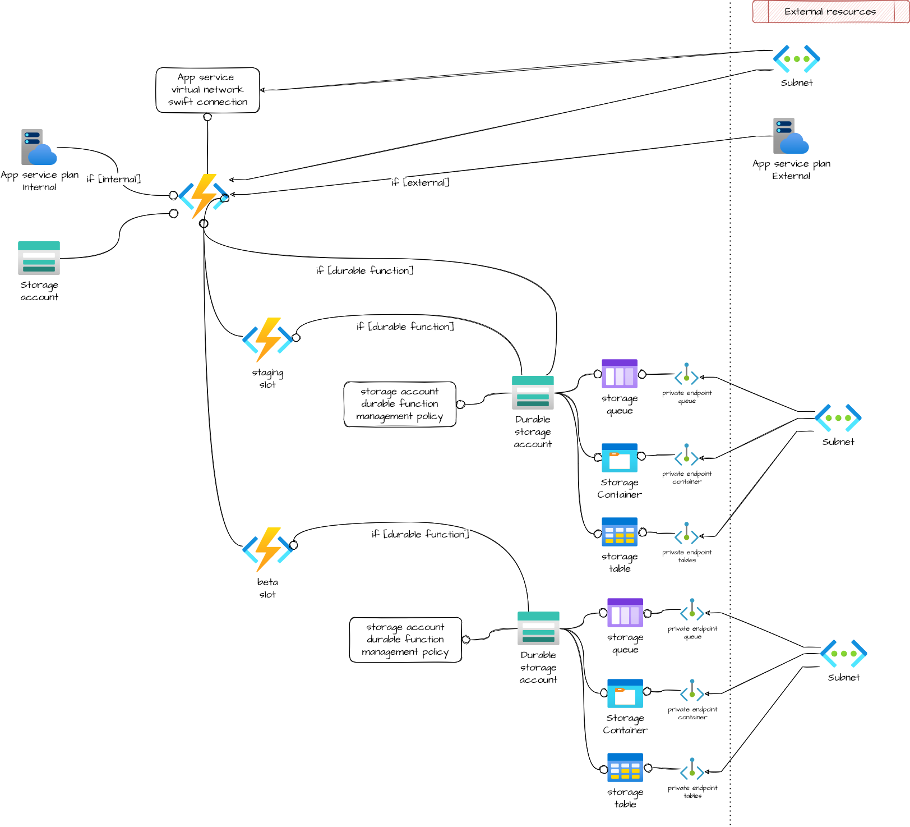

# Azure function app

Module that allows the creation of an Azure function app with a staging and a beta slots.

## Architecture



## How to use it

```ts
module "io_sign_issuer_func" {
  source = "git::https://github.com/pagopa/azurerm.git//function_app?ref=v3.2.6"

  name                                     = format("%s-func", local.project)
  location                                 = azurerm_resource_group.backend_rg.location
  resource_group_name                      = azurerm_resource_group.backend_rg.name
  subnet_id                                = module.subnet.id
  application_insights_instrumentation_key = data.azurerm_application_insights.monitor.instrumentation_key
  system_identity                          = true

  tags = var.tags
}
```

<!-- markdownlint-disable -->
<!-- BEGINNING OF PRE-COMMIT-TERRAFORM DOCS HOOK -->
## Requirements

| Name | Version |
|------|---------|
| <a name="requirement_terraform"></a> [terraform](#requirement\_terraform) | >= 1.1.0 |
| <a name="requirement_azurerm"></a> [azurerm](#requirement\_azurerm) | >= 2.80.0, <= 2.99.0 |

## Providers

| Name | Version |
|------|---------|
| <a name="provider_azurerm"></a> [azurerm](#provider\_azurerm) | 2.99.0 |

## Modules

| Name | Source | Version |
|------|--------|---------|
| <a name="module_app_snet"></a> [app\_snet](#module\_app\_snet) | git::https://github.com/pagopa/azurerm.git//subnet | v3.12.0 |
| <a name="module_function_app"></a> [function\_app](#module\_function\_app) | git::https://github.com/pagopa/azurerm.git//function_app | v3.12.0 |
| <a name="module_function_app_beta_slot"></a> [function\_app\_beta\_slot](#module\_function\_app\_beta\_slot) | git::https://github.com/pagopa/azurerm.git//function_app_slot | v3.12.0 |
| <a name="module_function_app_staging_slot"></a> [function\_app\_staging\_slot](#module\_function\_app\_staging\_slot) | git::https://github.com/pagopa/azurerm.git//function_app_slot | v3.12.0 |
| <a name="module_storage_account_for_beta"></a> [storage\_account\_for\_beta](#module\_storage\_account\_for\_beta) | git::https://github.com/pagopa/azurerm.git//storage_account_for_function | 70e0b77d672e9c8939bab8897ea7f72ca0880ce0 |

## Resources

| Name | Type |
|------|------|
| [azurerm_monitor_autoscale_setting.function_app](https://registry.terraform.io/providers/hashicorp/azurerm/latest/docs/resources/monitor_autoscale_setting) | resource |
| [azurerm_monitor_metric_alert.function_app_health_check](https://registry.terraform.io/providers/hashicorp/azurerm/latest/docs/resources/monitor_metric_alert) | resource |
| [azurerm_resource_group.function_app_rg](https://registry.terraform.io/providers/hashicorp/azurerm/latest/docs/resources/resource_group) | resource |

## Inputs

| Name | Description | Type | Default | Required |
|------|-------------|------|---------|:--------:|
| <a name="input_action"></a> [action](#input\_action) | (Optional) The ID of the Action Group and optional map of custom string properties to include with the post webhook operation. | <pre>set(object(<br>    {<br>      action_group_id    = string<br>      webhook_properties = map(string)<br>    }<br>  ))</pre> | `[]` | no |
| <a name="input_action_group_email_id"></a> [action\_group\_email\_id](#input\_action\_group\_email\_id) | (Required) Action group id used to sent alerts via email. | `string` | n/a | yes |
| <a name="input_action_group_slack_id"></a> [action\_group\_slack\_id](#input\_action\_group\_slack\_id) | (Required) Action group id used to sent alerts via slack. | `string` | n/a | yes |
| <a name="input_allowed_ips"></a> [allowed\_ips](#input\_allowed\_ips) | (Optional) The IP Address used for this IP Restriction in CIDR notation | `list(string)` | `[]` | no |
| <a name="input_allowed_subnets"></a> [allowed\_subnets](#input\_allowed\_subnets) | (Optional) List of subnet ids, The Virtual Network Subnet ID used for this IP Restriction. The AZ Devops will be automatic added to beta/staging slots. When creating multiple function ('function\_app\_count'), each function will be added by the module. | `list(string)` | `[]` | no |
| <a name="input_always_on"></a> [always\_on](#input\_always\_on) | (Optional) Should the app be loaded at all times? Defaults to null. | `bool` | `"true"` | no |
| <a name="input_app_service_plan_id"></a> [app\_service\_plan\_id](#input\_app\_service\_plan\_id) | (Optional) The external app service plan id to associate to the function. If null a new plan is created, use app\_service\_plan\_info to configure it. | `string` | `null` | no |
| <a name="input_app_service_plan_info"></a> [app\_service\_plan\_info](#input\_app\_service\_plan\_info) | (Optional) Allows to configurate the internal service plan | <pre>object({<br>    kind                         = string # The kind of the App Service Plan to create. Possible values are Windows (also available as App), Linux, elastic (for Premium Consumption) and FunctionApp (for a Consumption Plan).<br>    sku_tier                     = string # Specifies the plan's pricing tier.<br>    sku_size                     = string # Specifies the plan's instance size.<br>    maximum_elastic_worker_count = number # The maximum number of total workers allowed for this ElasticScaleEnabled App Service Plan.<br>  })</pre> | <pre>{<br>  "kind": "Linux",<br>  "maximum_elastic_worker_count": 0,<br>  "sku_size": "P1v3",<br>  "sku_tier": "PremiumV3"<br>}</pre> | no |
| <a name="input_app_service_plan_name"></a> [app\_service\_plan\_name](#input\_app\_service\_plan\_name) | (Optional) Name of the app service plan. If null it will be 'computed' | `string` | `null` | no |
| <a name="input_app_settings"></a> [app\_settings](#input\_app\_settings) | (Optional) The environment configurations set to the function. Please note that common configurations are already set by the module: add only your app-specific configurations. | `map(any)` | `{}` | no |
| <a name="input_application_insights_instrumentation_key"></a> [application\_insights\_instrumentation\_key](#input\_application\_insights\_instrumentation\_key) | (Required) Application insights instrumentation key | `string` | n/a | yes |
| <a name="input_azdoa_snet_id"></a> [azdoa\_snet\_id](#input\_azdoa\_snet\_id) | (Required) Azure devops agent subnet id. Used by Azure pipeline to deploy the function code. | `string` | n/a | yes |
| <a name="input_cidr_subnet_app"></a> [cidr\_subnet\_app](#input\_cidr\_subnet\_app) | (Required) Function app address space. | `list(string)` | n/a | yes |
| <a name="input_cors"></a> [cors](#input\_cors) | (Optional) An object containig only the field 'allowed\_origins': a list of origins which should be able to make cross-origin calls. * can be used to allow all calls. | <pre>object({<br>    allowed_origins = list(string) # A list of origins which should be able to make cross-origin calls. * can be used to allow all calls.<br>  })</pre> | `null` | no |
| <a name="input_domain"></a> [domain](#input\_domain) | (Optional) Specifies the domain of the Function App. | `string` | `"COMMON"` | no |
| <a name="input_enable_healthcheck"></a> [enable\_healthcheck](#input\_enable\_healthcheck) | (Optional) Enable the healthcheck alert. Default is true | `bool` | `true` | no |
| <a name="input_export_keys"></a> [export\_keys](#input\_export\_keys) | (Optional) Export the function keys in the module outputs. | `bool` | `false` | no |
| <a name="input_function_app_autoscale_default"></a> [function\_app\_autoscale\_default](#input\_function\_app\_autoscale\_default) | (Optional) The number of instances that are available for scaling if metrics are not available for evaluation. | `number` | `1` | no |
| <a name="input_function_app_autoscale_maximum"></a> [function\_app\_autoscale\_maximum](#input\_function\_app\_autoscale\_maximum) | (Optional) The maximum number of instances for this resource. | `number` | `30` | no |
| <a name="input_function_app_autoscale_minimum"></a> [function\_app\_autoscale\_minimum](#input\_function\_app\_autoscale\_minimum) | (Optional) The minimum number of instances for this resource. | `number` | `1` | no |
| <a name="input_function_app_count"></a> [function\_app\_count](#input\_function\_app\_count) | (Optional) Specifies the number of Function App that will be creater (deafult to 1) | `number` | `1` | no |
| <a name="input_health_check_maxpingfailures"></a> [health\_check\_maxpingfailures](#input\_health\_check\_maxpingfailures) | (Optional) Max ping failures allowed | `number` | `10` | no |
| <a name="input_health_check_path"></a> [health\_check\_path](#input\_health\_check\_path) | (Optional) Path which will be checked for this function app health. | `string` | `"/api/v1/info"` | no |
| <a name="input_healthcheck_threshold"></a> [healthcheck\_threshold](#input\_healthcheck\_threshold) | (Optional) The healthcheck threshold. If metric average is under this value, the alert will be triggered. Default is 50 | `number` | `50` | no |
| <a name="input_https_only"></a> [https\_only](#input\_https\_only) | (Optional) Can the Function App only be accessed only via HTTPS?. Defaults true | `bool` | `true` | no |
| <a name="input_internal_storage"></a> [internal\_storage](#input\_internal\_storage) | (Optional) Create an storage reachable only by the function. It's required for durable function. | <pre>object({<br>    enable                     = bool<br>    private_endpoint_subnet_id = string<br>    private_dns_zone_blob_ids  = list(string)<br>    private_dns_zone_queue_ids = list(string)<br>    private_dns_zone_table_ids = list(string)<br>    queues                     = list(string) # Queues names<br>    containers                 = list(string) # Containers names<br>    blobs_retention_days       = number<br>  })</pre> | <pre>{<br>  "blobs_retention_days": 1,<br>  "containers": [],<br>  "enable": false,<br>  "private_dns_zone_blob_ids": [],<br>  "private_dns_zone_queue_ids": [],<br>  "private_dns_zone_table_ids": [],<br>  "private_endpoint_subnet_id": "dummy",<br>  "queues": []<br>}</pre> | no |
| <a name="input_linux_fx_version"></a> [linux\_fx\_version](#input\_linux\_fx\_version) | (Optional) Linux App Framework and version for the AppService, e.g. DOCKER\|(golang:latest). Use null if function app is on windows | `string` | `"NODE|14"` | no |
| <a name="input_location"></a> [location](#input\_location) | (Required) Specifies the location where this module will create the resources. | `string` | n/a | yes |
| <a name="input_name"></a> [name](#input\_name) | (Required) Specifies the name of the Function App. Changing this forces a new resource to be created. Please do not specifies the suffix (the '-fn' suffix will be added by this module). | `string` | n/a | yes |
| <a name="input_os_type"></a> [os\_type](#input\_os\_type) | (Optional) A string indicating the Operating System type for this function app. This value will be linux for Linux derivatives, or an empty string for Windows (default). When set to linux you must also set azurerm\_app\_service\_plan arguments as kind = Linux and reserved = true | `string` | `"linux"` | no |
| <a name="input_pre_warmed_instance_count"></a> [pre\_warmed\_instance\_count](#input\_pre\_warmed\_instance\_count) | (Optional) The number of pre-warmed instances for this function app. Only affects apps on the Premium plan. | `number` | `1` | no |
| <a name="input_runtime_version"></a> [runtime\_version](#input\_runtime\_version) | (Optional) The runtime version associated with the Function App. Version ~3 is required for Linux Function Apps. | `string` | `"~4"` | no |
| <a name="input_storage_account_durable_name"></a> [storage\_account\_durable\_name](#input\_storage\_account\_durable\_name) | (Optional) Storage account name only used by the durable function. If null it will be 'computed' | `string` | `null` | no |
| <a name="input_storage_account_info"></a> [storage\_account\_info](#input\_storage\_account\_info) | (Optional) The Storage specific configurations. If not specified, will be used the common settings. | <pre>object({<br>    account_kind                      = string # Defines the Kind of account. Valid options are BlobStorage, BlockBlobStorage, FileStorage, Storage and StorageV2. Changing this forces a new resource to be created. Defaults to Storage.<br>    account_tier                      = string # Defines the Tier to use for this storage account. Valid options are Standard and Premium. For BlockBlobStorage and FileStorage accounts only Premium is valid.<br>    account_replication_type          = string # Defines the type of replication to use for this storage account. Valid options are LRS, GRS, RAGRS, ZRS, GZRS and RAGZRS.<br>    access_tier                       = string # Defines the access tier for BlobStorage, FileStorage and StorageV2 accounts. Valid options are Hot and Cool, defaults to Hot.<br>    advanced_threat_protection_enable = bool<br>  })</pre> | <pre>{<br>  "access_tier": "Hot",<br>  "account_kind": "StorageV2",<br>  "account_replication_type": "ZRS",<br>  "account_tier": "Standard",<br>  "advanced_threat_protection_enable": true<br>}</pre> | no |
| <a name="input_storage_account_name"></a> [storage\_account\_name](#input\_storage\_account\_name) | (Optional) Storage account name. If null it will be 'computed' | `string` | `null` | no |
| <a name="input_system_identity_enabled"></a> [system\_identity\_enabled](#input\_system\_identity\_enabled) | (Optional) Enable the System Identity and create relative Service Principal. | `bool` | `false` | no |
| <a name="input_tags"></a> [tags](#input\_tags) | (Optional) Set the specified tags to all the resources created by this module. | `map(any)` | <pre>{<br>  "CreatedBy": "Terraform"<br>}</pre> | no |
| <a name="input_use_32_bit_worker_process"></a> [use\_32\_bit\_worker\_process](#input\_use\_32\_bit\_worker\_process) | (Optional) Should the Function App run in 32 bit mode, rather than 64 bit mode? Defaults to false. | `bool` | `false` | no |
| <a name="input_vnet_integration"></a> [vnet\_integration](#input\_vnet\_integration) | (Optional) Enable vnet integration. Wheter it's true the subnet\_id should not be null. | `bool` | `true` | no |
| <a name="input_vnet_name"></a> [vnet\_name](#input\_vnet\_name) | (Required) The ID of the subnet the app service will be associated to (the subnet must have a service\_delegation configured for Microsoft.Web/serverFarms) | `string` | n/a | yes |
| <a name="input_vnet_resource_group"></a> [vnet\_resource\_group](#input\_vnet\_resource\_group) | (Required) The ID of the subnet the app service will be associated to (the subnet must have a service\_delegation configured for Microsoft.Web/serverFarms) | `string` | n/a | yes |

## Outputs

| Name | Description |
|------|-------------|
| <a name="output_beta_slots"></a> [beta\_slots](#output\_beta\_slots) | The list of the created beta slots. |
| <a name="output_main_functions"></a> [main\_functions](#output\_main\_functions) | The list of the created function app. |
| <a name="output_storage_account_internal_function_for_beta"></a> [storage\_account\_internal\_function\_for\_beta](#output\_storage\_account\_internal\_function\_for\_beta) | n/a |
<!-- END OF PRE-COMMIT-TERRAFORM DOCS HOOK -->
