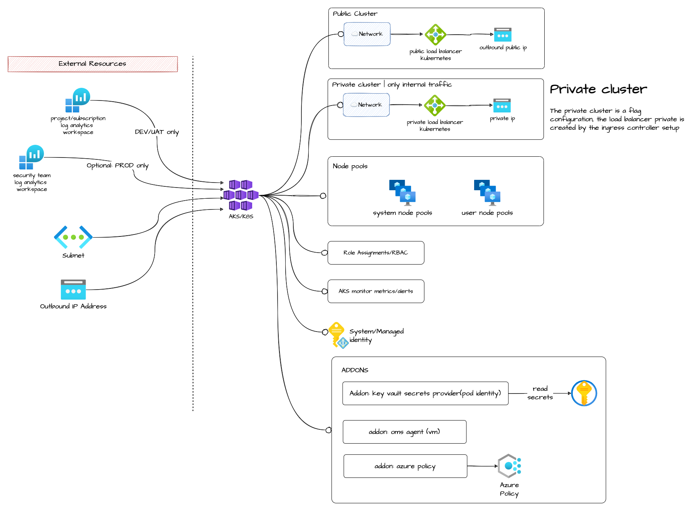

# kubernetes_cluster

Module that allows the creation of an AKS cluster.

## Architecture



## How to use it

```ts
data "azurerm_public_ip" "aks_outbound" {
  count = var.aks_num_outbound_ips

  resource_group_name = data.azurerm_resource_group.rg_vnet.name
  name                = "${local.aks_public_ip_name}-${count.index + 1}"
}

#--------------------------------------------------------------------------------------------------

resource "azurerm_resource_group" "rg_aks" {
  name     = local.aks_rg_name
  location = var.location
  tags     = var.tags
}

# k8s cluster subnet
module "k8s_snet" {
  source                                         = "git::https://github.com/pagopa/azurerm.git//subnet?ref=v2.0.3"
  name                                           = format("%s-k8s-snet", local.project)
  address_prefixes                               = var.cidr_subnet_k8s
  resource_group_name                            = data.azurerm_resource_group.rg_vnet.name
  virtual_network_name                           = data.azurerm_virtual_network.vnet.name
  enforce_private_link_endpoint_network_policies = var.aks_private_cluster_enabled

  service_endpoints = [
    "Microsoft.Web",
    "Microsoft.Storage"
  ]
}

module "aks" {
  source = "git::https://github.com/pagopa/azurerm.git//kubernetes_cluster?ref=v2.0.3"

  name                       = local.aks_cluster_name
  location                   = azurerm_resource_group.rg_aks.location
  dns_prefix                 = format("%s-aks", local.project)
  resource_group_name        = azurerm_resource_group.rg_aks.name
  availability_zones         = var.aks_availability_zones
  kubernetes_version         = var.kubernetes_version
  log_analytics_workspace_id = data.azurerm_log_analytics_workspace.log_analytics_workspace.id

  vm_size             = var.aks_vm_size
  enable_auto_scaling = var.aks_enable_auto_scaling
  node_count          = var.aks_node_count
  min_count           = var.aks_node_min_count
  max_count           = var.aks_node_max_count
  max_pods            = var.aks_max_pods
  sku_tier            = var.aks_sku_tier

  enable_azure_policy = true
  enable_azure_keyvault_secrets_provider = true

  private_cluster_enabled = var.aks_private_cluster_enabled

  rbac_enabled        = true
  aad_admin_group_ids = var.env_short == "d" ? [data.azuread_group.adgroup_admin.object_id, data.azuread_group.adgroup_developers.object_id, data.azuread_group.adgroup_externals.object_id] : [data.azuread_group.adgroup_admin.object_id]

  vnet_id        = data.azurerm_virtual_network.vnet.id
  vnet_subnet_id = module.k8s_snet.id

  network_profile = {
    docker_bridge_cidr = "172.17.0.1/16"
    dns_service_ip     = "10.2.0.10"
    network_plugin     = "azure"
    network_policy     = "azure"
    outbound_type      = "loadBalancer"
    service_cidr       = "10.2.0.0/16"
  }

  metric_alerts = var.aks_metric_alerts
  action = [
    {
      action_group_id    = data.azurerm_monitor_action_group.slack.id
      webhook_properties = null
    },
    {
      action_group_id    = data.azurerm_monitor_action_group.email.id
      webhook_properties = null
    }
  ]

  alerts_enabled = var.aks_alerts_enabled

  outbound_ip_address_ids = data.azurerm_public_ip.aks_outbound.*.id

  tags = var.tags
}

# add the role to the identity the kubernetes cluster was assigned
resource "azurerm_role_assignment" "aks_to_acr" {
  scope                = data.azurerm_container_registry.acr.id
  role_definition_name = "AcrPull"
  principal_id         = module.aks.kubelet_identity_id
}

resource "azurerm_key_vault_secret" "aks_apiserver_url" {
  name         = "aks-apiserver-url"
  value        = module.aks.fqdn
  key_vault_id = data.azurerm_key_vault.kv.id
}
```

<!-- markdownlint-disable -->
<!-- BEGINNING OF PRE-COMMIT-TERRAFORM DOCS HOOK -->
## Requirements

| Name | Version |
|------|---------|
| <a name="requirement_terraform"></a> [terraform](#requirement\_terraform) | >= 1.1.0 |
| <a name="requirement_azurerm"></a> [azurerm](#requirement\_azurerm) | >= 2.80.0, <= 2.99.0 |
| <a name="requirement_null"></a> [null](#requirement\_null) | >= 3.0.0 |

## Providers

| Name | Version |
|------|---------|
| <a name="provider_azurerm"></a> [azurerm](#provider\_azurerm) | 2.99.0 |
| <a name="provider_null"></a> [null](#provider\_null) | 3.1.1 |

## Modules

No modules.

## Resources

| Name | Type |
|------|------|
| [azurerm_kubernetes_cluster.this](https://registry.terraform.io/providers/hashicorp/azurerm/latest/docs/resources/kubernetes_cluster) | resource |
| [azurerm_kubernetes_cluster_node_pool.this](https://registry.terraform.io/providers/hashicorp/azurerm/latest/docs/resources/kubernetes_cluster_node_pool) | resource |
| [azurerm_monitor_diagnostic_setting.aks](https://registry.terraform.io/providers/hashicorp/azurerm/latest/docs/resources/monitor_diagnostic_setting) | resource |
| [azurerm_monitor_metric_alert.this](https://registry.terraform.io/providers/hashicorp/azurerm/latest/docs/resources/monitor_metric_alert) | resource |
| [azurerm_role_assignment.aks](https://registry.terraform.io/providers/hashicorp/azurerm/latest/docs/resources/role_assignment) | resource |
| [azurerm_role_assignment.vnet_outbound_role](https://registry.terraform.io/providers/hashicorp/azurerm/latest/docs/resources/role_assignment) | resource |
| [azurerm_role_assignment.vnet_role](https://registry.terraform.io/providers/hashicorp/azurerm/latest/docs/resources/role_assignment) | resource |
| [null_resource.b_series_not_ephemeral_check](https://registry.terraform.io/providers/hashicorp/null/latest/docs/resources/resource) | resource |

## Inputs

| Name | Description | Type | Default | Required |
|------|-------------|------|---------|:--------:|
| <a name="input_aad_admin_group_ids"></a> [aad\_admin\_group\_ids](#input\_aad\_admin\_group\_ids) | IDs of the Azure AD group for cluster-admin access | `list(string)` | n/a | yes |
| <a name="input_action"></a> [action](#input\_action) | The ID of the Action Group and optional map of custom string properties to include with the post webhook operation. | <pre>set(object(<br>    {<br>      action_group_id    = string<br>      webhook_properties = map(string)<br>    }<br>  ))</pre> | `[]` | no |
| <a name="input_addon_azure_keyvault_secrets_provider_enabled"></a> [addon\_azure\_keyvault\_secrets\_provider\_enabled](#input\_addon\_azure\_keyvault\_secrets\_provider\_enabled) | Should the Azure Secrets Store CSI addon be enabled for this Node Pool? | `bool` | `false` | no |
| <a name="input_addon_azure_pod_identity_enabled"></a> [addon\_azure\_pod\_identity\_enabled](#input\_addon\_azure\_pod\_identity\_enabled) | Should the AAD pod-managed identities be enabled for this Node Pool? | `bool` | `false` | no |
| <a name="input_addon_azure_policy_enabled"></a> [addon\_azure\_policy\_enabled](#input\_addon\_azure\_policy\_enabled) | Should the Azure Policy addon be enabled for this Node Pool? | `bool` | `false` | no |
| <a name="input_alerts_enabled"></a> [alerts\_enabled](#input\_alerts\_enabled) | Should Metrics Alert be enabled? | `bool` | `true` | no |
| <a name="input_api_server_authorized_ip_ranges"></a> [api\_server\_authorized\_ip\_ranges](#input\_api\_server\_authorized\_ip\_ranges) | The IP ranges to whitelist for incoming traffic to the masters. | `list(string)` | `[]` | no |
| <a name="input_automatic_channel_upgrade"></a> [automatic\_channel\_upgrade](#input\_automatic\_channel\_upgrade) | (Optional) The upgrade channel for this Kubernetes Cluster. Possible values are patch, rapid, node-image and stable. Omitting this field sets this value to none. | `string` | `null` | no |
| <a name="input_dns_prefix"></a> [dns\_prefix](#input\_dns\_prefix) | (Required) DNS prefix specified when creating the managed cluster. Changing this forces a new resource to be created. | `string` | n/a | yes |
| <a name="input_dns_prefix_private_cluster"></a> [dns\_prefix\_private\_cluster](#input\_dns\_prefix\_private\_cluster) | Specifies the DNS prefix to use with private clusters. Changing this forces a new resource to be created. | `string` | `null` | no |
| <a name="input_kubernetes_version"></a> [kubernetes\_version](#input\_kubernetes\_version) | (Required) Version of Kubernetes specified when creating the AKS managed cluster. | `string` | n/a | yes |
| <a name="input_location"></a> [location](#input\_location) | n/a | `string` | n/a | yes |
| <a name="input_log_analytics_workspace_id"></a> [log\_analytics\_workspace\_id](#input\_log\_analytics\_workspace\_id) | The ID of the Log Analytics Workspace which the OMS Agent should send data to. | `string` | `null` | no |
| <a name="input_metric_alerts"></a> [metric\_alerts](#input\_metric\_alerts) | Map of name = criteria objects | <pre>map(object({<br>    # criteria.*.aggregation to be one of [Average Count Minimum Maximum Total]<br>    aggregation = string<br>    metric_name = string<br>    # "Insights.Container/pods" "Insights.Container/nodes"<br>    metric_namespace = string<br>    # criteria.0.operator to be one of [Equals NotEquals GreaterThan GreaterThanOrEqual LessThan LessThanOrEqual]<br>    operator  = string<br>    threshold = number<br>    # Possible values are PT1M, PT5M, PT15M, PT30M and PT1H<br>    frequency = string<br>    # Possible values are PT1M, PT5M, PT15M, PT30M, PT1H, PT6H, PT12H and P1D.<br>    window_size = string<br><br>    dimension = list(object(<br>      {<br>        name     = string<br>        operator = string<br>        values   = list(string)<br>      }<br>    ))<br>  }))</pre> | `{}` | no |
| <a name="input_name"></a> [name](#input\_name) | (Required) Cluster name | `string` | n/a | yes |
| <a name="input_network_profile"></a> [network\_profile](#input\_network\_profile) | See variable description to understand how to use it, and see examples | <pre>object({<br>    docker_bridge_cidr = string # e.g. '172.17.0.1/16'<br>    dns_service_ip     = string # e.g. '10.2.0.10'. IP address within the Kubernetes service address range that will be used by cluster service discovery (kube-dns)<br>    network_policy     = string # e.g. 'azure'. Sets up network policy to be used with Azure CNI. Currently supported values are calico and azure.<br>    network_plugin     = string # e.g. 'azure'. Network plugin to use for networking. Currently supported values are azure and kubenet<br>    outbound_type      = string # e.g. 'loadBalancer'. The outbound (egress) routing method which should be used for this Kubernetes Cluster. Possible values are loadBalancer, userDefinedRouting, managedNATGateway and userAssignedNATGateway. Defaults to loadBalancer<br>    service_cidr       = string # e.g. '10.2.0.0/16'. The Network Range used by the Kubernetes service<br>  })</pre> | <pre>{<br>  "dns_service_ip": "10.2.0.10",<br>  "docker_bridge_cidr": "172.17.0.1/16",<br>  "network_plugin": "azure",<br>  "network_policy": "azure",<br>  "outbound_type": "loadBalancer",<br>  "service_cidr": "10.2.0.0/16"<br>}</pre> | no |
| <a name="input_outbound_ip_address_ids"></a> [outbound\_ip\_address\_ids](#input\_outbound\_ip\_address\_ids) | The ID of the Public IP Addresses which should be used for outbound communication for the cluster load balancer. | `list(string)` | `[]` | no |
| <a name="input_private_cluster_enabled"></a> [private\_cluster\_enabled](#input\_private\_cluster\_enabled) | (Optional) Provides a Private IP Address for the Kubernetes API on the Virtual Network where the Kubernetes Cluster is located. | `bool` | `false` | no |
| <a name="input_rbac_enabled"></a> [rbac\_enabled](#input\_rbac\_enabled) | Is Role Based Access Control Enabled? | `bool` | `true` | no |
| <a name="input_resource_group_name"></a> [resource\_group\_name](#input\_resource\_group\_name) | (Required) Resource group name. | `string` | n/a | yes |
| <a name="input_sec_log_analytics_workspace_id"></a> [sec\_log\_analytics\_workspace\_id](#input\_sec\_log\_analytics\_workspace\_id) | Log analytics workspace security (it should be in a different subscription). | `string` | `null` | no |
| <a name="input_sec_storage_id"></a> [sec\_storage\_id](#input\_sec\_storage\_id) | Storage Account security (it should be in a different subscription). | `string` | `null` | no |
| <a name="input_sku_tier"></a> [sku\_tier](#input\_sku\_tier) | (Optional) The SKU Tier that should be used for this Kubernetes Cluster. Possible values are Free and Paid (which includes the Uptime SLA) | `string` | `"Free"` | no |
| <a name="input_system_node_pool_enable_host_encryption"></a> [system\_node\_pool\_enable\_host\_encryption](#input\_system\_node\_pool\_enable\_host\_encryption) | (Optional) Should the nodes in the Default Node Pool have host encryption enabled? Defaults to true. | `bool` | `false` | no |
| <a name="input_system_node_pool_max_pods"></a> [system\_node\_pool\_max\_pods](#input\_system\_node\_pool\_max\_pods) | (Optional) The maximum number of pods that can run on each agent. Changing this forces a new resource to be created. | `number` | `250` | no |
| <a name="input_system_node_pool_name"></a> [system\_node\_pool\_name](#input\_system\_node\_pool\_name) | (Required) The name which should be used for the default Kubernetes Node Pool. Changing this forces a new resource to be created. | `string` | n/a | yes |
| <a name="input_system_node_pool_node_count_max"></a> [system\_node\_pool\_node\_count\_max](#input\_system\_node\_pool\_node\_count\_max) | (Required) The maximum number of nodes which should exist in this Node Pool. If specified this must be between 1 and 1000. | `number` | n/a | yes |
| <a name="input_system_node_pool_node_count_min"></a> [system\_node\_pool\_node\_count\_min](#input\_system\_node\_pool\_node\_count\_min) | (Required) The minimum number of nodes which should exist in this Node Pool. If specified this must be between 1 and 1000. | `number` | n/a | yes |
| <a name="input_system_node_pool_node_labels"></a> [system\_node\_pool\_node\_labels](#input\_system\_node\_pool\_node\_labels) | (Optional) A map of Kubernetes labels which should be applied to nodes in the Default Node Pool. Changing this forces a new resource to be created. | `map(any)` | `{}` | no |
| <a name="input_system_node_pool_only_critical_addons_enabled"></a> [system\_node\_pool\_only\_critical\_addons\_enabled](#input\_system\_node\_pool\_only\_critical\_addons\_enabled) | (Optional) Enabling this option will taint default node pool with CriticalAddonsOnly=true:NoSchedule taint. Changing this forces a new resource to be created. | `bool` | `true` | no |
| <a name="input_system_node_pool_os_disk_size_gb"></a> [system\_node\_pool\_os\_disk\_size\_gb](#input\_system\_node\_pool\_os\_disk\_size\_gb) | (Optional) The size of the OS Disk which should be used for each agent in the Node Pool. Changing this forces a new resource to be created. | `number` | n/a | yes |
| <a name="input_system_node_pool_os_disk_type"></a> [system\_node\_pool\_os\_disk\_type](#input\_system\_node\_pool\_os\_disk\_type) | (Optional) The type of disk which should be used for the Operating System. Possible values are Ephemeral and Managed. Defaults to Managed. | `string` | `"Ephemeral"` | no |
| <a name="input_system_node_pool_tags"></a> [system\_node\_pool\_tags](#input\_system\_node\_pool\_tags) | (Optional) A mapping of tags to assign to the Node Pool. | `map(any)` | `{}` | no |
| <a name="input_system_node_pool_ultra_ssd_enabled"></a> [system\_node\_pool\_ultra\_ssd\_enabled](#input\_system\_node\_pool\_ultra\_ssd\_enabled) | (Optional) Used to specify whether the UltraSSD is enabled in the Default Node Pool. Defaults to false. | `bool` | `false` | no |
| <a name="input_system_node_pool_vm_size"></a> [system\_node\_pool\_vm\_size](#input\_system\_node\_pool\_vm\_size) | (Required) The size of the Virtual Machine, such as Standard\_B4ms or Standard\_D4s\_vX. See https://pagopa.atlassian.net/wiki/spaces/DEVOPS/pages/134840344/Best+practice+su+prodotti | `string` | n/a | yes |
| <a name="input_tags"></a> [tags](#input\_tags) | n/a | `map(any)` | n/a | yes |
| <a name="input_upgrade_settings_max_surge"></a> [upgrade\_settings\_max\_surge](#input\_upgrade\_settings\_max\_surge) | The maximum number or percentage of nodes which will be added to the Node Pool size during an upgrade. | `string` | `"33%"` | no |
| <a name="input_user_node_pool_enable_host_encryption"></a> [user\_node\_pool\_enable\_host\_encryption](#input\_user\_node\_pool\_enable\_host\_encryption) | (Optional) Should the nodes in the Default Node Pool have host encryption enabled? Defaults to true. | `bool` | `false` | no |
| <a name="input_user_node_pool_enabled"></a> [user\_node\_pool\_enabled](#input\_user\_node\_pool\_enabled) | Is user node pool enabled? | `bool` | `false` | no |
| <a name="input_user_node_pool_max_pods"></a> [user\_node\_pool\_max\_pods](#input\_user\_node\_pool\_max\_pods) | (Optional) The maximum number of pods that can run on each agent. Changing this forces a new resource to be created. | `number` | `250` | no |
| <a name="input_user_node_pool_name"></a> [user\_node\_pool\_name](#input\_user\_node\_pool\_name) | (Required) The name which should be used for the default Kubernetes Node Pool. Changing this forces a new resource to be created. | `string` | n/a | yes |
| <a name="input_user_node_pool_node_count_max"></a> [user\_node\_pool\_node\_count\_max](#input\_user\_node\_pool\_node\_count\_max) | (Required) The maximum number of nodes which should exist in this Node Pool. If specified this must be between 1 and 1000. | `number` | n/a | yes |
| <a name="input_user_node_pool_node_count_min"></a> [user\_node\_pool\_node\_count\_min](#input\_user\_node\_pool\_node\_count\_min) | (Required) The minimum number of nodes which should exist in this Node Pool. If specified this must be between 1 and 1000. | `number` | n/a | yes |
| <a name="input_user_node_pool_node_labels"></a> [user\_node\_pool\_node\_labels](#input\_user\_node\_pool\_node\_labels) | (Optional) A map of Kubernetes labels which should be applied to nodes in the Default Node Pool. Changing this forces a new resource to be created. | `map(any)` | `{}` | no |
| <a name="input_user_node_pool_node_taints"></a> [user\_node\_pool\_node\_taints](#input\_user\_node\_pool\_node\_taints) | (Optional) A list of Kubernetes taints which should be applied to nodes in the agent pool (e.g key=value:NoSchedule). Changing this forces a new resource to be created. | `list(string)` | `[]` | no |
| <a name="input_user_node_pool_only_critical_addons_enabled"></a> [user\_node\_pool\_only\_critical\_addons\_enabled](#input\_user\_node\_pool\_only\_critical\_addons\_enabled) | (Optional) Enabling this option will taint default node pool with CriticalAddonsOnly=true:NoSchedule taint. Changing this forces a new resource to be created. | `bool` | `true` | no |
| <a name="input_user_node_pool_os_disk_size_gb"></a> [user\_node\_pool\_os\_disk\_size\_gb](#input\_user\_node\_pool\_os\_disk\_size\_gb) | (Optional) The size of the OS Disk which should be used for each agent in the Node Pool. Changing this forces a new resource to be created. | `number` | n/a | yes |
| <a name="input_user_node_pool_os_disk_type"></a> [user\_node\_pool\_os\_disk\_type](#input\_user\_node\_pool\_os\_disk\_type) | (Optional) The type of disk which should be used for the Operating System. Possible values are Ephemeral and Managed. Defaults to Managed. | `string` | `"Ephemeral"` | no |
| <a name="input_user_node_pool_tags"></a> [user\_node\_pool\_tags](#input\_user\_node\_pool\_tags) | (Optional) A mapping of tags to assign to the Node Pool. | `map(any)` | `{}` | no |
| <a name="input_user_node_pool_ultra_ssd_enabled"></a> [user\_node\_pool\_ultra\_ssd\_enabled](#input\_user\_node\_pool\_ultra\_ssd\_enabled) | (Optional) Used to specify whether the UltraSSD is enabled in the Default Node Pool. Defaults to false. | `bool` | `false` | no |
| <a name="input_user_node_pool_vm_size"></a> [user\_node\_pool\_vm\_size](#input\_user\_node\_pool\_vm\_size) | (Required) The size of the Virtual Machine, such as Standard\_B4ms or Standard\_D4s\_vX. See https://pagopa.atlassian.net/wiki/spaces/DEVOPS/pages/134840344/Best+practice+su+prodotti | `string` | n/a | yes |
| <a name="input_vnet_id"></a> [vnet\_id](#input\_vnet\_id) | (Required) Virtual network id, where the k8s cluster is deployed. | `string` | n/a | yes |
| <a name="input_vnet_subnet_id"></a> [vnet\_subnet\_id](#input\_vnet\_subnet\_id) | (Optional) The ID of a Subnet where the Kubernetes Node Pool should exist. Changing this forces a new resource to be created. | `string` | `null` | no |

## Outputs

| Name | Description |
|------|-------------|
| <a name="output_client_certificate"></a> [client\_certificate](#output\_client\_certificate) | n/a |
| <a name="output_fqdn"></a> [fqdn](#output\_fqdn) | n/a |
| <a name="output_id"></a> [id](#output\_id) | n/a |
| <a name="output_kube_config"></a> [kube\_config](#output\_kube\_config) | n/a |
| <a name="output_kubelet_identity_id"></a> [kubelet\_identity\_id](#output\_kubelet\_identity\_id) | n/a |
| <a name="output_name"></a> [name](#output\_name) | n/a |
| <a name="output_private_fqdn"></a> [private\_fqdn](#output\_private\_fqdn) | n/a |
<!-- END OF PRE-COMMIT-TERRAFORM DOCS HOOK -->
