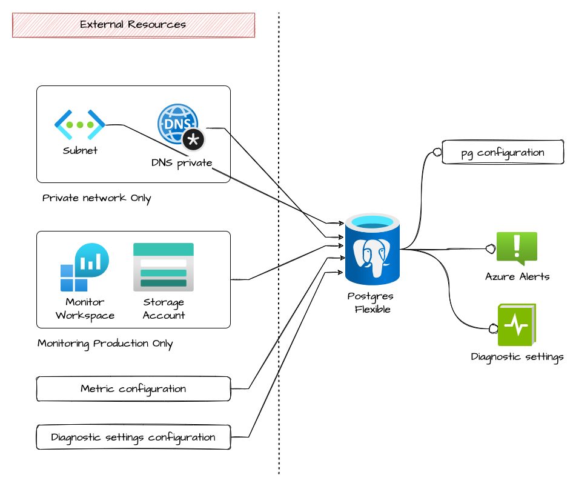

# postgres flexible

Module that allows the creation of a postgres flexible.

## Architecture



## How to use it

```ts

```

<!-- markdownlint-disable -->
<!-- BEGINNING OF PRE-COMMIT-TERRAFORM DOCS HOOK -->
## Requirements

| Name | Version |
|------|---------|
| <a name="requirement_terraform"></a> [terraform](#requirement\_terraform) | >= 1.1.0 |
| <a name="requirement_azurerm"></a> [azurerm](#requirement\_azurerm) | >= 2.80.0, <= 2.99.0 |

## Providers

| Name | Version |
|------|---------|
| <a name="provider_azurerm"></a> [azurerm](#provider\_azurerm) | 2.95.0 |
| <a name="provider_null"></a> [null](#provider\_null) | n/a |

## Modules

No modules.

## Resources

| Name | Type |
|------|------|
| [azurerm_postgresql_flexible_server.this](https://registry.terraform.io/providers/hashicorp/azurerm/latest/docs/resources/postgresql_flexible_server) | resource |
| [azurerm_postgresql_flexible_server_configuration.pgbouncer_enabled](https://registry.terraform.io/providers/hashicorp/azurerm/latest/docs/resources/postgresql_flexible_server_configuration) | resource |
| [null_resource.ha_sku_check](https://registry.terraform.io/providers/hashicorp/null/latest/docs/resources/resource) | resource |
| [null_resource.pgbouncer_check](https://registry.terraform.io/providers/hashicorp/null/latest/docs/resources/resource) | resource |

## Inputs

| Name | Description | Type | Default | Required |
|------|-------------|------|---------|:--------:|
| <a name="input_administrator_login"></a> [administrator\_login](#input\_administrator\_login) | The Administrator Login for the PostgreSQL Flexible Server. Required when create\_mode is Default. | `string` | n/a | yes |
| <a name="input_administrator_password"></a> [administrator\_password](#input\_administrator\_password) | The Password associated with the administrator\_login for the PostgreSQL Flexible Server. Required when create\_mode is Default. | `string` | n/a | yes |
| <a name="input_backup_retention_days"></a> [backup\_retention\_days](#input\_backup\_retention\_days) | (Optional) The backup retention days for the PostgreSQL Flexible Server. Possible values are between 7 and 35 days. | `number` | `7` | no |
| <a name="input_create_mode"></a> [create\_mode](#input\_create\_mode) | (Optional) The creation mode. Can be used to restore or replicate existing servers. Possible values are Default, Replica, GeoRestore, and PointInTimeRestore | `string` | `"Default"` | no |
| <a name="input_db_version"></a> [db\_version](#input\_db\_version) | (Required) The version of PostgreSQL Flexible Server to use. Possible values are 11,12 and 13. Required when create\_mode is Default | `number` | n/a | yes |
| <a name="input_delegated_subnet_id"></a> [delegated\_subnet\_id](#input\_delegated\_subnet\_id) | (Optional) The ID of the virtual network subnet to create the PostgreSQL Flexible Server. The provided subnet should not have any other resource deployed in it and this subnet will be delegated to the PostgreSQL Flexible Server, if not already delegated. | `string` | `null` | no |
| <a name="input_geo_redundant_backup_enabled"></a> [geo\_redundant\_backup\_enabled](#input\_geo\_redundant\_backup\_enabled) | (Optional) Is Geo-Redundant backup enabled on the PostgreSQL Flexible Server. Defaults to false | `bool` | `false` | no |
| <a name="input_high_availability_enabled"></a> [high\_availability\_enabled](#input\_high\_availability\_enabled) | (Required) Is the High Availability Enabled | `bool` | n/a | yes |
| <a name="input_location"></a> [location](#input\_location) | (Required) The Azure Region where the PostgreSQL Flexible Server should exist. | `string` | n/a | yes |
| <a name="input_maintenance_window_config"></a> [maintenance\_window\_config](#input\_maintenance\_window\_config) | (Optional) Allows the configuration of the maintenance window, if not configured default is Wednesday@2.00am | <pre>object({<br>    day_of_week  = number<br>    start_hour   = number<br>    start_minute = number<br>  })</pre> | <pre>{<br>  "day_of_week": 3,<br>  "start_hour": 2,<br>  "start_minute": 0<br>}</pre> | no |
| <a name="input_name"></a> [name](#input\_name) | (Required) The name which should be used for this PostgreSQL Flexible Server. Changing this forces a new PostgreSQL Flexible Server to be created. | `string` | n/a | yes |
| <a name="input_pgbouncer_enabled"></a> [pgbouncer\_enabled](#input\_pgbouncer\_enabled) | Is PgBouncer enabled into configurations? | `bool` | `true` | no |
| <a name="input_private_dns_zone_id"></a> [private\_dns\_zone\_id](#input\_private\_dns\_zone\_id) | (Optional) The ID of the private dns zone to create the PostgreSQL Flexible Server. Changing this forces a new PostgreSQL Flexible Server to be created. | `string` | `null` | no |
| <a name="input_private_endpoint_enabled"></a> [private\_endpoint\_enabled](#input\_private\_endpoint\_enabled) | Is this instance private only? | `bool` | n/a | yes |
| <a name="input_resource_group_name"></a> [resource\_group\_name](#input\_resource\_group\_name) | (Required) The name of the Resource Group where the PostgreSQL Flexible Server should exist. | `string` | n/a | yes |
| <a name="input_sku_name"></a> [sku\_name](#input\_sku\_name) | The SKU Name for the PostgreSQL Flexible Server. The name of the SKU, follows the tier + name pattern (e.g. B\_Standard\_B1ms, GP\_Standard\_D2s\_v3, MO\_Standard\_E4s\_v3). | `string` | n/a | yes |
| <a name="input_standby_availability_zone"></a> [standby\_availability\_zone](#input\_standby\_availability\_zone) | (Optional) Specifies the Availability Zone in which the standby Flexible Server should be located. | `number` | `null` | no |
| <a name="input_storage_mb"></a> [storage\_mb](#input\_storage\_mb) | The max storage allowed for the PostgreSQL Flexible Server. Possible values are 32768, 65536, 131072, 262144, 524288, 1048576, 2097152, 4194304, 8388608, 16777216, and 33554432. | `number` | `null` | no |
| <a name="input_tags"></a> [tags](#input\_tags) | n/a | `map(any)` | n/a | yes |
| <a name="input_zone"></a> [zone](#input\_zone) | (Optional) Specifies the Availability Zone in which the PostgreSQL Flexible Server should be located. | `number` | `1` | no |

## Outputs

| Name | Description |
|------|-------------|
| <a name="output_administrator_login"></a> [administrator\_login](#output\_administrator\_login) | n/a |
| <a name="output_administrator_password"></a> [administrator\_password](#output\_administrator\_password) | n/a |
| <a name="output_connection_port"></a> [connection\_port](#output\_connection\_port) | n/a |
| <a name="output_fqdn"></a> [fqdn](#output\_fqdn) | n/a |
| <a name="output_id"></a> [id](#output\_id) | n/a |
| <a name="output_name"></a> [name](#output\_name) | n/a |
| <a name="output_public_access_enabled"></a> [public\_access\_enabled](#output\_public\_access\_enabled) | n/a |
<!-- END OF PRE-COMMIT-TERRAFORM DOCS HOOK -->
