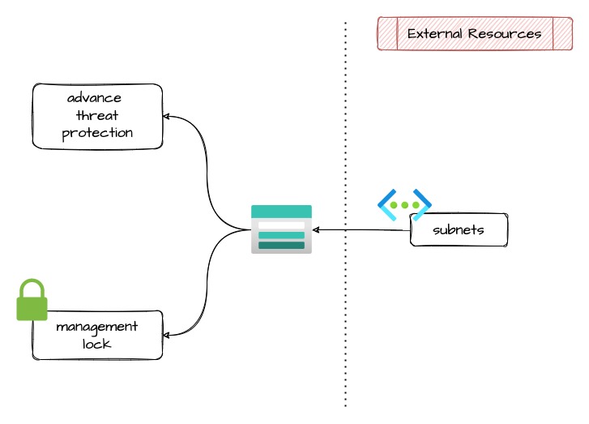

# storage account

Module that allows the creation of an Storage account.

## Architecture



## How to use it

```ts
module "selc-contracts-storage" {
  source = "git::https://github.com/pagopa/azurerm.git//storage_account?ref=v2.5.2"

  name                       = replace(format("%s-contracts-storage", local.project), "-", "")
  account_kind               = "StorageV2"
  account_tier               = "Standard"
  account_replication_type   = var.contracts_account_replication_type
  access_tier                = "Hot"
  enable_versioning          = var.contracts_enable_versioning
  resource_group_name        = azurerm_resource_group.rg_contracts_storage.name
  location                   = var.location
  advanced_threat_protection = var.contracts_advanced_threat_protection
  allow_blob_public_access   = false

  blob_properties_delete_retention_policy_days = var.contracts_delete_retention_days

  tags = var.tags
}

```

## 🔥 Breaking change

* removed `versioning_name` attribute, please remove from the definition

<!-- markdownlint-disable -->
<!-- BEGINNING OF PRE-COMMIT-TERRAFORM DOCS HOOK -->
## Requirements

| Name | Version |
|------|---------|
| <a name="requirement_terraform"></a> [terraform](#requirement\_terraform) | >= 1.1.0 |
| <a name="requirement_azurerm"></a> [azurerm](#requirement\_azurerm) | >= 2.80.0, <= 2.99.0 |

## Providers

| Name | Version |
|------|---------|
| <a name="provider_azurerm"></a> [azurerm](#provider\_azurerm) | 2.99.0 |

## Modules

No modules.

## Resources

| Name | Type |
|------|------|
| [azurerm_advanced_threat_protection.this](https://registry.terraform.io/providers/hashicorp/azurerm/latest/docs/resources/advanced_threat_protection) | resource |
| [azurerm_management_lock.management_lock](https://registry.terraform.io/providers/hashicorp/azurerm/latest/docs/resources/management_lock) | resource |
| [azurerm_monitor_metric_alert.storage_account_low_availability](https://registry.terraform.io/providers/hashicorp/azurerm/latest/docs/resources/monitor_metric_alert) | resource |
| [azurerm_storage_account.this](https://registry.terraform.io/providers/hashicorp/azurerm/latest/docs/resources/storage_account) | resource |

## Inputs

| Name | Description | Type | Default | Required |
|------|-------------|------|---------|:--------:|
| <a name="input_access_tier"></a> [access\_tier](#input\_access\_tier) | (Optional) Defines the access tier for BlobStorage, FileStorage and StorageV2 accounts. Valid options are Hot and Cool, defaults to Hot | `string` | `null` | no |
| <a name="input_account_kind"></a> [account\_kind](#input\_account\_kind) | (Optional) Defines the Kind of account. Valid options are BlobStorage, BlockBlobStorage, FileStorage, Storage and StorageV2. Changing this forces a new resource to be created. | `string` | `"StorageV2"` | no |
| <a name="input_account_replication_type"></a> [account\_replication\_type](#input\_account\_replication\_type) | Defines the type of replication to use for this storage account. Valid options are LRS, GRS, RAGRS, ZRS, GZRS and RAGZRS. Changing this forces a new resource to be created when types LRS, GRS and RAGRS are changed to ZRS, GZRS or RAGZRS and vice versa | `string` | n/a | yes |
| <a name="input_account_tier"></a> [account\_tier](#input\_account\_tier) | Defines the Tier to use for this storage account. Valid options are Standard and Premium. For BlockBlobStorage and FileStorage accounts only Premium is valid. Changing this forces a new resource to be created. | `string` | n/a | yes |
| <a name="input_action"></a> [action](#input\_action) | The ID of the Action Group and optional map of custom string properties to include with the post webhook operation. | <pre>set(object(<br>    {<br>      action_group_id    = string<br>      webhook_properties = map(string)<br>    }<br>  ))</pre> | `[]` | no |
| <a name="input_advanced_threat_protection"></a> [advanced\_threat\_protection](#input\_advanced\_threat\_protection) | Should Advanced Threat Protection be enabled on this resource? | `string` | `false` | no |
| <a name="input_allow_blob_public_access"></a> [allow\_blob\_public\_access](#input\_allow\_blob\_public\_access) | Allow or disallow public access to all blobs or containers in the storage account. | `bool` | `false` | no |
| <a name="input_blob_properties_delete_retention_policy_days"></a> [blob\_properties\_delete\_retention\_policy\_days](#input\_blob\_properties\_delete\_retention\_policy\_days) | Enable soft delete policy and specify the number of days that the blob should be retained. Between 1 and 365 days | `number` | `null` | no |
| <a name="input_custom_domain"></a> [custom\_domain](#input\_custom\_domain) | Custom domain for accessing blob data | <pre>object({<br>    name          = string<br>    use_subdomain = bool<br>  })</pre> | <pre>{<br>  "name": null,<br>  "use_subdomain": false<br>}</pre> | no |
| <a name="input_domain"></a> [domain](#input\_domain) | (Optional) Specifies the domain of the Storage Account. | `string` | `null` | no |
| <a name="input_enable_https_traffic_only"></a> [enable\_https\_traffic\_only](#input\_enable\_https\_traffic\_only) | Boolean flag which forces HTTPS if enabled, see here for more information. Defaults to true | `bool` | `true` | no |
| <a name="input_enable_low_availability_alert"></a> [enable\_low\_availability\_alert](#input\_enable\_low\_availability\_alert) | Enable the Low Availability alert. Default is true | `bool` | `true` | no |
| <a name="input_enable_versioning"></a> [enable\_versioning](#input\_enable\_versioning) | Enable versioning in the blob storage account. | `bool` | `false` | no |
| <a name="input_error_404_document"></a> [error\_404\_document](#input\_error\_404\_document) | The absolute path to a custom webpage that should be used when a request is made which does not correspond to an existing file. | `string` | `null` | no |
| <a name="input_index_document"></a> [index\_document](#input\_index\_document) | The webpage that Azure Storage serves for requests to the root of a website or any subfolder. For example, index.html. The value is case-sensitive. | `string` | `null` | no |
| <a name="input_is_hns_enabled"></a> [is\_hns\_enabled](#input\_is\_hns\_enabled) | Enable Hierarchical Namespace enabled (Azure Data Lake Storage Gen 2). Changing this forces a new resource to be created. | `bool` | `false` | no |
| <a name="input_location"></a> [location](#input\_location) | n/a | `string` | n/a | yes |
| <a name="input_lock_enabled"></a> [lock\_enabled](#input\_lock\_enabled) | Is lock enabled? | `bool` | `false` | no |
| <a name="input_lock_level"></a> [lock\_level](#input\_lock\_level) | Specifies the Level to be used for this Lock. Possible values are CanNotDelete and ReadOnly. | `string` | `null` | no |
| <a name="input_lock_name"></a> [lock\_name](#input\_lock\_name) | Specifies the name of the Management Lock. Changing this forces a new resource to be created. | `string` | `null` | no |
| <a name="input_lock_notes"></a> [lock\_notes](#input\_lock\_notes) | Specifies some notes about the lock. Maximum of 512 characters. | `string` | `null` | no |
| <a name="input_low_availability_threshold"></a> [low\_availability\_threshold](#input\_low\_availability\_threshold) | The Low Availability threshold. If metric average is under this value, the alert will be triggered. Default is 99.8 | `number` | `99.8` | no |
| <a name="input_min_tls_version"></a> [min\_tls\_version](#input\_min\_tls\_version) | The minimum supported TLS version for the storage account. Possible values are TLS1\_0, TLS1\_1, and TLS1\_2 | `string` | `"TLS1_2"` | no |
| <a name="input_name"></a> [name](#input\_name) | n/a | `string` | n/a | yes |
| <a name="input_network_rules"></a> [network\_rules](#input\_network\_rules) | n/a | <pre>object({<br>    default_action             = string       # Specifies the default action of allow or deny when no other rules match. Valid options are Deny or Allow<br>    bypass                     = set(string)  # Specifies whether traffic is bypassed for Logging/Metrics/AzureServices. Valid options are any combination of Logging, Metrics, AzureServices, or None<br>    ip_rules                   = list(string) # List of public IP or IP ranges in CIDR Format. Only IPV4 addresses are allowed<br>    virtual_network_subnet_ids = list(string) # A list of resource ids for subnets.<br>  })</pre> | `null` | no |
| <a name="input_resource_group_name"></a> [resource\_group\_name](#input\_resource\_group\_name) | n/a | `string` | n/a | yes |
| <a name="input_tags"></a> [tags](#input\_tags) | n/a | `map(any)` | n/a | yes |

## Outputs

| Name | Description |
|------|-------------|
| <a name="output_id"></a> [id](#output\_id) | n/a |
| <a name="output_name"></a> [name](#output\_name) | n/a |
| <a name="output_primary_access_key"></a> [primary\_access\_key](#output\_primary\_access\_key) | n/a |
| <a name="output_primary_blob_connection_string"></a> [primary\_blob\_connection\_string](#output\_primary\_blob\_connection\_string) | n/a |
| <a name="output_primary_blob_host"></a> [primary\_blob\_host](#output\_primary\_blob\_host) | n/a |
| <a name="output_primary_connection_string"></a> [primary\_connection\_string](#output\_primary\_connection\_string) | n/a |
| <a name="output_primary_web_host"></a> [primary\_web\_host](#output\_primary\_web\_host) | n/a |
<!-- END OF PRE-COMMIT-TERRAFORM DOCS HOOK -->
