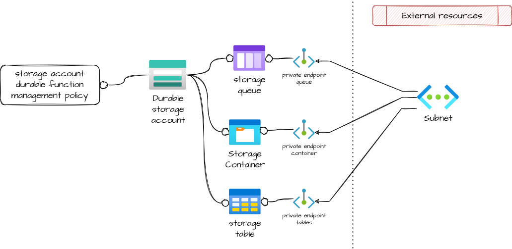

# Azure function app

Module that allows the creation of an Storage account protected by private endpoints and initialized with a list of queues, containers and/or tables.

## Architecture



## How to use it

```ts
module "storage_account_for_beta" {
  source = "git::https://github.com/pagopa/azurerm.git//storage_account_for_function?ref=v3.2.6"

  location            = "westeurope"
  resource_group_name = "dummy-rg"
  storage_account_durable_name = "dummy-st"
  subnet_id = var.private_endpoints_subnet_id,
  internal_queues = ["dummy_queue"]
  internal_containers = ["dummy_container"]
  internal_tables = ["dummy_tables"]
  private_endpoint_subnet_id = var.private_endpoint_subnet_id
  private_dns_zone_blob_ids = var.private_dns_zone_blob_ids
  private_dns_zone_table_ids = var.private_dns_zone_table_ids
  private_dns_zone_queue_ids = var.private_dns_zone_queue_ids
  tags = var.tags
}
```

<!-- markdownlint-disable -->
<!-- BEGINNING OF PRE-COMMIT-TERRAFORM DOCS HOOK -->
## Requirements

| Name | Version |
|------|---------|
| <a name="requirement_terraform"></a> [terraform](#requirement\_terraform) | >= 1.1.0 |
| <a name="requirement_azurerm"></a> [azurerm](#requirement\_azurerm) | >= 2.80.0, <= 2.99.0 |

## Providers

| Name | Version |
|------|---------|
| <a name="provider_azurerm"></a> [azurerm](#provider\_azurerm) | 2.99.0 |

## Modules

| Name | Source | Version |
|------|--------|---------|
| <a name="module_storage_account_durable_function"></a> [storage\_account\_durable\_function](#module\_storage\_account\_durable\_function) | git::https://github.com/pagopa/azurerm.git//storage_account | v2.7.0 |
| <a name="module_storage_account_durable_function_management_policy"></a> [storage\_account\_durable\_function\_management\_policy](#module\_storage\_account\_durable\_function\_management\_policy) | git::https://github.com/pagopa/azurerm.git//storage_management_policy | v3.6.1 |

## Resources

| Name | Type |
|------|------|
| [azurerm_private_endpoint.blob](https://registry.terraform.io/providers/hashicorp/azurerm/latest/docs/resources/private_endpoint) | resource |
| [azurerm_private_endpoint.queue](https://registry.terraform.io/providers/hashicorp/azurerm/latest/docs/resources/private_endpoint) | resource |
| [azurerm_private_endpoint.table](https://registry.terraform.io/providers/hashicorp/azurerm/latest/docs/resources/private_endpoint) | resource |
| [azurerm_storage_container.internal_container](https://registry.terraform.io/providers/hashicorp/azurerm/latest/docs/resources/storage_container) | resource |
| [azurerm_storage_queue.internal_queue](https://registry.terraform.io/providers/hashicorp/azurerm/latest/docs/resources/storage_queue) | resource |
| [azurerm_storage_table.internal_tables](https://registry.terraform.io/providers/hashicorp/azurerm/latest/docs/resources/storage_table) | resource |

## Inputs

| Name | Description | Type | Default | Required |
|------|-------------|------|---------|:--------:|
| <a name="input_blobs_retention_days"></a> [blobs\_retention\_days](#input\_blobs\_retention\_days) | (Optional) The retantion of blobs in the container. If not specified, the default is 1 day. | `number` | `1` | no |
| <a name="input_internal_containers"></a> [internal\_containers](#input\_internal\_containers) | (Optional) a list of container names. For each name will be craeted a container in the storage. | `list(string)` | `[]` | no |
| <a name="input_internal_queues"></a> [internal\_queues](#input\_internal\_queues) | (Optional) a list of queue names. For each name will be craeted a queue in the storage. | `list(string)` | `[]` | no |
| <a name="input_internal_tables"></a> [internal\_tables](#input\_internal\_tables) | (Optional) a list of table names. For each name will be craeted a table in the storage. | `list(string)` | `[]` | no |
| <a name="input_location"></a> [location](#input\_location) | (Required) Specifies the location where this module will create the resources. | `string` | n/a | yes |
| <a name="input_private_dns_zone_blob_ids"></a> [private\_dns\_zone\_blob\_ids](#input\_private\_dns\_zone\_blob\_ids) | (Optional) A list of private dns zone ids for blobs | `list(string)` | `[]` | no |
| <a name="input_private_dns_zone_queue_ids"></a> [private\_dns\_zone\_queue\_ids](#input\_private\_dns\_zone\_queue\_ids) | (Optional) A list of private dns zone ids for queues | `list(string)` | `[]` | no |
| <a name="input_private_dns_zone_table_ids"></a> [private\_dns\_zone\_table\_ids](#input\_private\_dns\_zone\_table\_ids) | (Optional) A list of private dns zone ids for tables | `list(string)` | `[]` | no |
| <a name="input_private_endpoint_subnet_id"></a> [private\_endpoint\_subnet\_id](#input\_private\_endpoint\_subnet\_id) | (Required) The subnet id for the private endpoint used to access to blobs | `number` | n/a | yes |
| <a name="input_resource_group_name"></a> [resource\_group\_name](#input\_resource\_group\_name) | (Required) Specifies the resource group where this module will create the resources. | `string` | n/a | yes |
| <a name="input_storage_account_durable_name"></a> [storage\_account\_durable\_name](#input\_storage\_account\_durable\_name) | (Optional) Storage account name only used by the durable function. If null it will be 'computed' | `string` | `null` | no |
| <a name="input_subnet_id"></a> [subnet\_id](#input\_subnet\_id) | (Required) The ID of the subnet the app service will be associated to (the subnet must have a service\_delegation configured for Microsoft.Web/serverFarms) | `string` | n/a | yes |
| <a name="input_tags"></a> [tags](#input\_tags) | (Optional) Set the specified tags to all the resources created by this module. | `map(any)` | n/a | yes |

## Outputs

| Name | Description |
|------|-------------|
| <a name="output_id"></a> [id](#output\_id) | n/a |
| <a name="output_name"></a> [name](#output\_name) | n/a |
| <a name="output_primary_access_key"></a> [primary\_access\_key](#output\_primary\_access\_key) | n/a |
| <a name="output_primary_blob_connection_string"></a> [primary\_blob\_connection\_string](#output\_primary\_blob\_connection\_string) | n/a |
| <a name="output_primary_blob_host"></a> [primary\_blob\_host](#output\_primary\_blob\_host) | n/a |
| <a name="output_primary_connection_string"></a> [primary\_connection\_string](#output\_primary\_connection\_string) | n/a |
| <a name="output_primary_web_host"></a> [primary\_web\_host](#output\_primary\_web\_host) | n/a |
<!-- END OF PRE-COMMIT-TERRAFORM DOCS HOOK -->
